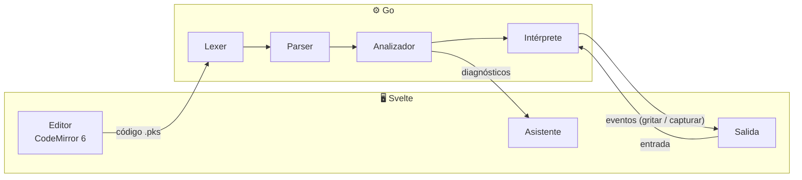

<div align="center">


<br>


<br>


<br><br>

<b>Un lenguaje de programación pedagógico con temática Pokémon,<br>con su propio IDE de escritorio y un asistente que te enseña mientras programas.</b>

<br><br>


</div>

---

## 📖 Contenido

- [¿Qué es PokeScript?](#-qué-es-pokescript)
- [Así se ve](#-así-se-ve)
- [Los tipos del lenguaje](#-los-tipos-del-lenguaje)
- [Características](#-características)
- [Mensajes que enseñan](#-mensajes-que-enseñan)
- [Arquitectura](#-arquitectura)
- [Hoja de ruta](#-hoja-de-ruta)
- [Cómo empezar](#-cómo-empezar)
- [Cómo contribuir](#-cómo-contribuir)
- [Aviso](#-aviso)

---

## 🔴 ¿Qué es PokeScript?


**PokeScript** es un lenguaje de programación en **español** hecho para quienes están aprendiendo a programar. Las palabras clave vienen del mundo Pokémon: los programas arrancan con `combate`, las funciones son `movimiento`s, las constantes son `medalla`s y para mostrar algo en pantalla… se usa `gritar`.

Detrás del tema hay un lenguaje serio: **tipado estático**, análisis semántico completo, **nulabilidad explícita**, coincidencia de patrones **exhaustiva** y proyectos de varios archivos. Todo eso corre dentro de un IDE de escritorio con un **asistente pedagógico** que no solo te dice qué salió mal, sino **por qué** y **cómo arreglarlo**.

> Proyecto del curso **Paradigmas de Programación**, Universidad Nacional (UNA), II ciclo 2026.

---

## ✨ Así se ve

<div align="center">

</div>

---

## 🧬 Los tipos del lenguaje

Cada tipo de dato es un tipo de Pokémon. Y como en los combates, **no todos los tipos se llevan bien**: las conversiones siguen una _tabla de efectividades_.

<div align="center">

|                                                                               Pokémon                                                                               | Tipo        | Qué guarda                 | Ejemplo                          |
| :-----------------------------------------------------------------------------------------------------------------------------------------------------------------: | ----------- | -------------------------- | -------------------------------- |
|     | `roca`      | Números enteros            | `roca vida = 100`                |
|     | `agua`      | Números decimales          | `agua precision = 0.95`          |
|   | `fuego`     | Un solo carácter           | `fuego inicial = 'P'`            |
|    | `planta`    | Texto                      | `planta nombre = "Bulbasaur"`    |
|     | `electrico` | `verdadero` o `falso`      | `electrico listo = verdadero`    |
|      | `especie`   | Un valor de una lista fija | `Estado e = DORMIDO`             |
|    | `equipo`    | Lista (índices desde 1)    | `equipo de roca niveles`         |
|  | `mochila`   | Diccionario ordenado       | `mochila de planta a roca bolsa` |

</div>

Y para cuando algo **puede no existir**: `posible planta rival = fantasma`. El compilador no te deja usar un `posible` sin comprobar antes que no sea `fantasma`.

---

## ⚡ Características

<table>
<tr>
<td width="50%" valign="top">

### 🎓 Pensado para aprender

- Palabras clave **en español** y con sentido
- **Una instrucción por línea**, sin `;` ni llaves
- Índices que empiezan en **1**
- Sin veracidad implícita: los `si` piden un `electrico`
- Todo se pasa **por valor**: sin efectos colaterales sorpresa

</td>
<td width="50%" valign="top">

### 🛡️ Un compilador que te cuida

- **Tipado estático** con tabla de efectividades
- Revisa que ningún dato se lea **antes de tener valor**
- `segun` **exhaustivo**: te dice qué casos faltan
- **Nulabilidad** con `posible` / `fantasma`
- Te dice **en qué línea abriste** el bloque que no cerraste

</td>
</tr>
<tr>
<td width="50%" valign="top">

### 🧩 Proyectos de verdad

- Varios archivos `.pks` con `enseñar … desde`
- Detecta **importaciones circulares** y muestra la cadena completa
- `ficha` para registros, `especie` para enumeraciones
- `equipo` y `mochila` para colecciones

</td>
<td width="50%" valign="top">

### 🤖 Asistente pedagógico

- Explica cada error **con palabras simples**
- Sugiere el nombre correcto cuando te equivocas al escribir (distancia de edición)
- Propone **arreglos que se aplican con un clic**
- Funciona sin conexión y sin servicios externos

</td>
</tr>
</table>

---

## 💬 Mensajes que enseñan

Los diagnósticos llevan encabezados que cualquier entrenador reconoce:

| Situación                             | Mensaje                            |
| ------------------------------------- | ---------------------------------- |
| ✅ Compilación exitosa                | **¡Es superefectivo!**             |
| ❌ Error de tipos                     | **No es muy efectivo…**            |
| 🧱 Error de sintaxis o bloque abierto | **¡Se escapó!**                    |
| 👻 Dato sin valor o no declarado      | **¡No pasó nada!**                 |
| 💥 Error en ejecución                 | **¡Falló el ataque!**              |
| 🗺️ Problema de importación            | **No se encontró la ruta**         |
| ⚠️ Advertencia                        | **¿Seguro que quieres hacer eso?** |

Un error completo se ve así:

```text
No es muy efectivo…
Tipo de error: semántico
Archivo: principal.pks
Línea: 12
Columna: 13
Descripción: no es posible sumar un valor de tipo roca con uno de tipo electrico.
Posible causa: la combinación de estos dos tipos no tiene efecto según la tabla de efectividades.
Sugerencia: consultar la tabla de efectividades desde el menú del entorno.
```

---

## 🔧 Arquitectura



| Capa       | Tecnología                                  |
| ---------- | ------------------------------------------- |
| Escritorio | [Wails](https://wails.io)                   |
| Compilador | Go: lexer, parser, analizador e intérprete  |
| Interfaz   | Svelte + CodeMirror 6                       |
| Extras     | Howler.js (audio) · PixiJS (salida gráfica) |

---

## 🧭 Hoja de ruta

Cada hito es una medalla de gimnasio 🏅

- [ ] **1.** Lexer completo y resaltado en el editor
- [ ] **2.** Parser de expresiones: `2 + 3 * 4`
- [ ] **3.** Parser de instrucciones y bloques
- [ ] **4.** Intérprete: `gritar`, variables, `si`, `mientras`: **¡el primer programa corriendo!**
- [ ] **5.** Tabla de símbolos y chequeo de tipos
- [ ] **6.** Movimientos, parámetros y retorno
- [ ] **7.** Colecciones: `equipo` y `mochila`
- [ ] **8.** `especie` y `segun` exhaustivo
- [ ] **9.** Importaciones y grafo de dependencias
- [ ] **10.** `posible` / `fantasma` con estrechamiento
- [ ] **11.** `ficha`
- [ ] **12.** Asistente pedagógico

---

## 🚀 Cómo empezar

### Requisitos

| Herramienta                                                    | Versión         |
| -------------------------------------------------------------- | --------------- |
| [Go](https://go.dev/dl/)                                       | 1.23 o superior |
| [Node.js](https://nodejs.org)                                  | 22 o superior   |
| [Wails CLI](https://wails.io/docs/gettingstarted/installation) | v2              |

### Pasos

```bash
git clone https://github.com/keylorpineda/PokeScript.git
cd PokeScript
npm install
git config commit.template .gitmessage
```

`npm install` activa los hooks de Git (Husky) que revisan el formato, la ortografía y los mensajes de commit.

> 🥚 El huevo todavía no eclosiona: los comandos para correr el IDE (`wails dev`) se agregan cuando esté el proyecto Wails.

### Estructura

```text
PokeScript/
├── internal/          ← compilador e intérprete en Go (sin dependencias de la interfaz)
├── frontend/          ← interfaz en Svelte
├── docs/              ← especificación del lenguaje y recursos del README
├── .github/workflows/ ← pipeline de CI
└── CONTRIBUTING.md    ← estándares del equipo
```

La especificación completa del lenguaje está en [`docs/PokeScript_Especificacion_Implementacion.md`](docs/PokeScript_Especificacion_Implementacion.md).

---

## 🤝 Cómo contribuir

Los commits siguen el formato **PKS convencional**, en inglés:

```text
PKS feat(lexer): recognize sino si as a single SINO_SI token
PKS fix(parser): report the line where an unclosed block was opened
```

Husky los valida al hacer commit y el CI los vuelve a revisar en cada push. Todos los detalles (tipos, alcances, herramientas y flujo de ramas) están en [CONTRIBUTING.md](CONTRIBUTING.md).

---

## 📜 Aviso

Proyecto académico sin fines de lucro. Pokémon y todos los nombres relacionados son marcas de Nintendo, Game Freak y The Pokémon Company. Los sprites vienen de [PokeAPI](https://github.com/PokeAPI/sprites). Este proyecto no está afiliado ni respaldado por ellos.

<div align="center">

<br>


<sub>Hecho con ⚡ en la UNA · 2026</sub>

</div>
