<div align="center">


</div>



Trae su propio editor de escritorio. Mientras lo terminamos, los programas ya corren desde la terminal.

<sub>Proyecto del curso Paradigmas de Programación · Universidad Nacional · II ciclo 2026</sub>


## Contenido

- [El editor](#el-editor)
- [Tipos](#tipos)
- [Lo básico](#lo-básico)
- [Programas completos](#programas-completos)
- [Por dentro](#por-dentro)
- [Medallas](#medallas)
- [Probarlo](#probarlo)
- [Contribuir](#contribuir)


## El editor



## Tipos


<div align="center">

|                                                                               Pokémon                                                                               | Tipo        | Qué guarda                 | Ejemplo                          |
| :-----------------------------------------------------------------------------------------------------------------------------------------------------------------: | ----------- | -------------------------- | -------------------------------- |
|     | `roca`      | Números enteros            | `roca vida = 100`                |
|     | `agua`      | Números decimales          | `agua precision = 0.95`          |
|   | `fuego`     | Un solo carácter           | `fuego inicial = 'P'`            |
|    | `planta`    | Texto                      | `planta nombre = "Bulbasaur"`    |
|     | `electrico` | `verdadero` o `falso`      | `electrico listo = verdadero`    |
|      | `especie`   | Un valor de una lista fija | `Estado e = DORMIDO`             |
|    | `equipo`    | Lista (índices desde 1)    | `equipo de roca niveles`         |
|  | `mochila`   | Diccionario ordenado       | `mochila de planta a roca bolsa` |

</div>

Y como en los combates, no todos se llevan bien. La tabla de efectividades dice qué se convierte solo, qué necesita `convertir` y qué no se puede hacer.


Si un programa mezcla dos tipos que no se llevan, no llega a ejecutarse:


Por ejemplo, este programa:

```text
combate
    roca x = 1 + verdadero
fin
```

recibe esta respuesta:

```text
No es muy efectivo…
Tipo de error: semántico
Archivo: principal.pks
Línea: 2
Columna: 14
Descripción: no es posible sumar un valor de tipo roca con uno de tipo electrico.
Posible causa: la combinación de estos dos tipos no tiene efecto según la tabla de efectividades.
Sugerencia: consultar la tabla de efectividades desde el menú del entorno.
```

Cada clase de problema tiene su encabezado:

| Encabezado                     | Cuándo aparece                                                         |
| ------------------------------ | ---------------------------------------------------------------------- |
| ¡Es superefectivo!             | El programa compiló sin errores                                        |
| No es muy efectivo…            | Tipos que no se llevan o una regla del lenguaje que no se cumple       |
| ¡Se escapó!                    | Algo mal escrito, como un bloque sin su `fin`                          |
| ¡No pasó nada!                 | Un nombre que no existe o un dato que se usa antes de tener valor      |
| No se encontró la ruta         | Un problema al importar otro archivo                                   |
| ¡Falló el ataque!              | El programa se cayó mientras corría, por ejemplo al dividir entre cero |
| ¿Seguro que quieres hacer eso? | Un aviso: el programa corre, pero algo se ve raro                      |


## Lo básico

Lo necesario para leer y escribir PokeScript. Cada bloque se puede copiar tal cual.

### Hola, mundo


```text
combate
    gritar "¡Hola, mundo Pokémon!"
fin
```

### Datos y medallas


```text
medalla roca NIVEL_MAXIMO = 100

combate
    roca nivel = 5
    agua precision = 0.85
    fuego rango = 'S'
    planta nombre = "Pikachu"
    electrico brillante = falso

    nivel = nivel + 1
    gritar nombre, " está en el nivel ", nivel, " de ", NIVEL_MAXIMO
fin
```

### Decisiones


```text
si vida > 50
    gritar "¡En plena forma!"
sino si vida > 0
    gritar "Necesita una poción"
sino
    gritar "Se debilitó…"
fin
```

Para muchos casos está `segun`. Si elige entre números o textos necesita la rama `otro`, porque esos valores no se acaban nunca:

```text
segun ataque
    'F'      entonces gritar "¡Lanzallamas!"
    'A', 'H' entonces gritar "¡Hidrobomba!"
    otro     entonces gritar "Placaje"
fin
```

### Ciclos


```text
// De un número a otro (ambos incluidos)
recorrer n de 1 hasta 5
    gritar "Pokébola número ", n
fin

// Por cada elemento de una colección
recorrer pokemon en mi_equipo
    si pokemon igual "Magikarp"
        siguiente
    fin
    gritar pokemon, " está listo"
fin

// Mientras se cumpla la condición
mientras vida > 0
    vida = vida - 10
    si vida < 20
        huir
    fin
fin
```

### Movimientos


```text
movimiento roca calcular_dano(roca ataque, roca defensa)
    entregar ataque * 2 - defensa
fin

movimiento saludar(planta entrenador)
    gritar "¡Hola, ", entrenador, "! Bienvenido al Centro Pokémon"
fin

combate
    saludar("Ash")
    roca dano = calcular_dano(55, 40)
    gritar "El ataque hizo ", dano, " de daño"
fin
```

### Equipo y mochila


```text
equipo de planta equipo_ash = ["Pikachu", "Charizard"]
sumar "Bulbasaur" a equipo_ash
gritar equipo_ash[1]
quitar equipo_ash[2]
gritar "Quedan ", tamaño(equipo_ash), " Pokémon"

mochila de planta a roca objetos = {"Poción": 3, "Pokébola": 10}
objetos["Poción"] = objetos["Poción"] - 1
si objetos contiene "Pokébola"
    gritar "Tienes ", objetos["Pokébola"], " Pokébolas"
fin
```

### Especies y fichas


```text
especie Clima
    SOLEADO, LLUVIA, GRANIZO
fin

ficha Entrenador
    planta nombre
    roca   medallas
    Clima  clima_favorito
fin

combate
    Entrenador misty = {nombre: "Misty", medallas: 2, clima_favorito: LLUVIA}
    misty.medallas = misty.medallas + 1
    gritar misty.nombre, " ya tiene ", misty.medallas, " medallas"
fin
```

### Conversiones


```text
planta texto = "25"
roca numero = convertir(texto) a roca
agua decimal = numero
planta mensaje = convertir(numero) a planta
roca redondo = redondear(7.5)
roca dado = aleatorio(1, 6)
```

### Varios archivos


```text
enseñar calcular_dano desde "operaciones.pks"
enseñar Estado, Pokemon desde "tipos.pks"
```

## Programas completos

Cada animación es un programa real con su salida real. Están en [`ejemplos/`](ejemplos) y las pruebas del proyecto los ejecutan.

### Entrenamiento


<div align="center">

</div>

<details>
<summary>Ver el código</summary>

```text
// entrenamiento.pks · equipo, mochila y ciclos
combate
    equipo de planta mi_equipo = ["Pikachu", "Charmander", "Squirtle"]
    sumar "Bulbasaur" a mi_equipo
    gritar "Tu equipo tiene ", tamaño(mi_equipo), " Pokémon"

    mochila de planta a roca bayas = {"Aranja": 3, "Zreza": 0, "Meloc": 5}
    recorrer baya, cantidad en bayas
        si cantidad igual 0
            siguiente
        fin
        gritar "  ", baya, " x", cantidad
    fin

    roca nivel = 5
    mientras nivel < 10
        nivel = nivel + 2
    fin
    gritar "Nivel final: ", nivel
fin
```

</details>

### Estados alterados


<div align="center">

</div>

<details>
<summary>Ver el código</summary>

```text
// estados.pks · especie, ficha, segun y movimientos
especie Estado
    SANO, ENVENENADO, DORMIDO
fin

ficha Pokemon
    planta nombre
    roca   vida
    Estado estado
fin

movimiento roca pasar_turno(Pokemon p)
    roca dano = 0
    segun p.estado
        SANO        entonces gritar p.nombre, " está en plena forma"
        ENVENENADO  entonces dano = 10
        DORMIDO     entonces gritar p.nombre, " sigue dormido…"
    fin
    entregar p.vida - dano
fin

combate
    Pokemon bulbi = {nombre: "Bulbasaur", vida: 45, estado: ENVENENADO}
    recorrer t de 1 hasta 3
        bulbi.vida = pasar_turno(bulbi)
        gritar "Turno ", t, ": ", bulbi.nombre, " tiene ", bulbi.vida, " PS"
    fin
fin
```

</details>

### Centro Pokémon


<div align="center">

</div>

<details>
<summary>Ver el código</summary>

```text
// centro.pks · capturar, contiene y sino si
movimiento electrico es_legendario(planta nombre)
    equipo de planta legendarios = ["Mewtwo", "Lugia", "Rayquaza"]
    entregar legendarios contiene nombre
fin

combate
    planta nombre
    roca nivel
    capturar(nombre, "¿Qué Pokémon atrapaste? ")
    capturar(nivel, "¿De qué nivel? ")

    si es_legendario(nombre)
        gritar "¡Increíble! ", nombre, " es legendario"
    sino si nivel >= 50
        gritar nombre, " ya es todo un veterano"
    sino
        agua progreso = nivel / 100
        gritar nombre, " va al ", redondear(progreso * 100), "% del camino"
    fin
fin
```

</details>

### Cuando falta un `fin`


<div align="center">

</div>

### Combate por turnos


<details>
<summary>constantes.pks</summary>

```text
medalla roca VIDA_MAXIMA = 100
medalla roca NIVEL       = 25
```

</details>

<details>
<summary>tipos.pks</summary>

```text
especie Estado
    SANO, ENVENENADO, DORMIDO, PARALIZADO
fin

ficha Pokemon
    planta nombre
    roca   vida
    Estado estado
fin
```

</details>

<details>
<summary>operaciones.pks</summary>

```text
enseñar NIVEL desde "constantes.pks"

// Daño base con variación al azar del 85% al 100%
movimiento roca calcular_dano(roca poder)
    agua base      = poder * NIVEL / 50
    roca variacion = aleatorio(85, 100)
    agua total     = base * variacion / 100
    entregar redondear(total) + 2
fin
```

</details>

<details>
<summary>principal.pks</summary>

```text
enseñar calcular_dano desde "operaciones.pks"
enseñar Estado, Pokemon desde "tipos.pks"
enseñar VIDA_MAXIMA desde "constantes.pks"

movimiento describir(Estado actual)
    segun actual
        SANO                 entonces gritar "  Puede atacar"
        ENVENENADO           entonces gritar "  Pierde vida cada turno"
        DORMIDO, PARALIZADO  entonces gritar "  Podría no atacar"
    fin
fin

combate
    planta nombre
    capturar(nombre, "¿Cómo se llama tu Pokemon? ")

    Pokemon mio   = {nombre: nombre,   vida: VIDA_MAXIMA, estado: SANO}
    Pokemon rival = {nombre: "Bulbi", vida: VIDA_MAXIMA, estado: SANO}

    gritar "¡", mio.nombre, " entra en combate!"
    describir(mio.estado)

    recorrer turno de 1 hasta 20
        gritar "--- Turno ", turno, " ---"

        roca dano = calcular_dano(40)
        rival.vida = rival.vida - dano
        gritar mio.nombre, " ataca y hace ", dano, " de daño"

        si rival.vida <= 0
            gritar rival.nombre, " se debilitó. ¡Ganaste!"
            huir
        fin

        roca contra = calcular_dano(35)
        mio.vida = mio.vida - contra
        gritar rival.nombre, " contraataca: ", contra, " de daño"
        gritar "Vida de ", mio.nombre, ": ", mio.vida

        si mio.vida <= 0
            gritar mio.nombre, " se debilitó. Perdiste."
            huir
        fin
    fin
fin
```

</details>


## Por dentro


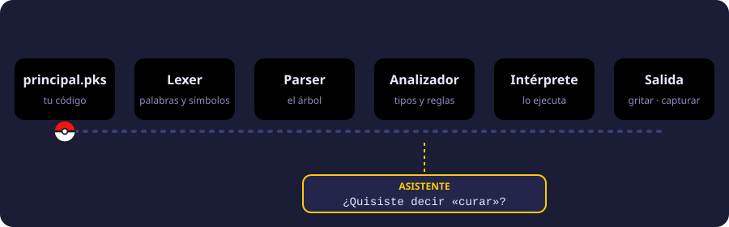

El compilador y el intérprete están escritos en Go. El editor usa Svelte y CodeMirror 6, y Wails los junta en una aplicación de escritorio. Las reglas completas del lenguaje están en la [especificación](docs/PokeScript_Especificacion_Implementacion.md).


## Medallas




## Probarlo


Descargas: [Go](https://go.dev/dl/) · [Node.js](https://nodejs.org) · [pnpm](https://pnpm.io/installation)

```bash
git clone https://github.com/keylorpineda/PokeScript.git
cd PokeScript
pnpm install
git config commit.template .gitmessage
```

Para correr un programa:

```bash
go run ./cmd/pks ejemplos/hola.pks
```

Y el combate por turnos, que tiene cuatro archivos:

```bash
go run ./cmd/pks ejemplos/combate
```

```text
PokeScript/
├── internal/   compilador, intérprete y asistente
├── cmd/pks/    el comando para la terminal
├── ejemplos/   los programas de este README
└── docs/       especificación, plan del equipo y animaciones
```


## Contribuir

Los commits van en inglés con el formato `PKS type(scope): description`, y cada cambio entra a `dev` por un pull request. Los detalles están en [CONTRIBUTING.md](CONTRIBUTING.md) y el reparto de tareas en [docs/PLAN.md](docs/PLAN.md).


<div align="center">


<sub>Proyecto académico sin fines de lucro. Pokémon y sus nombres son marcas de Nintendo, Game Freak y The Pokémon Company; este proyecto no está afiliado a ellas. Sprites de <a href="https://github.com/PokeAPI/sprites">PokeAPI</a>.</sub>

</div>
