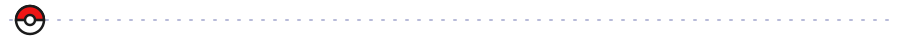
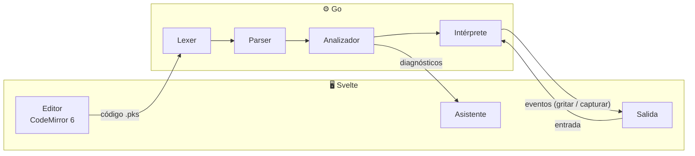

<div align="center">



<br>


<br>


<br><br>

<b>Un lenguaje de programación pedagógico con temática Pokémon,<br>con su propio IDE de escritorio y un asistente que te enseña mientras programas.</b>

<br><br>


</div>



## 📖 Contenido

- [¿Qué es PokeScript?](#-qué-es-pokescript)
- [Así se ve](#-así-se-ve)
- [Los tipos del lenguaje](#-los-tipos-del-lenguaje)
- [Guía rápida](#-guía-rápida)
- [Ejemplos completos](#-ejemplos-completos)
- [Características](#-características)
- [Mensajes que enseñan](#-mensajes-que-enseñan)
- [Arquitectura](#-arquitectura)
- [Hoja de ruta](#-hoja-de-ruta)
- [Cómo empezar](#-cómo-empezar)
- [Cómo contribuir](#-cómo-contribuir)
- [Aviso](#-aviso)


## 🔴 ¿Qué es PokeScript?


**PokeScript** es un lenguaje de programación en **español** hecho para quienes están aprendiendo a programar. Las palabras clave vienen del mundo Pokémon: los programas arrancan con `combate`, las funciones son `movimiento`s, las constantes son `medalla`s y para mostrar algo en pantalla… se usa `gritar`.

Detrás del tema hay un lenguaje serio: **tipado estático**, análisis semántico completo, coincidencia de patrones **exhaustiva** y proyectos de varios archivos. Todo eso corre dentro de un IDE de escritorio con un **asistente pedagógico** que no solo te dice qué salió mal, sino **por qué** y **cómo arreglarlo**.

> Proyecto del curso **Paradigmas de Programación**, Universidad Nacional (UNA), II ciclo 2026.


## ✨ Así se ve

<div align="center">

</div>


## 🧬 Los tipos del lenguaje

Cada tipo de dato es un tipo de Pokémon. Y como en los combates, **no todos los tipos se llevan bien**: las conversiones siguen una _tabla de efectividades_.

<div align="center">

|                                                                               Pokémon                                                                               | Tipo        | Qué guarda                 | Ejemplo                          |
| :-----------------------------------------------------------------------------------------------------------------------------------------------------------------: | ----------- | -------------------------- | -------------------------------- |
|     | `roca`      | Números enteros            | `roca vida = 100`                |
|     | `agua`      | Números decimales          | `agua precision = 0.95`          |
|   | `fuego`     | Un solo carácter           | `fuego inicial = 'P'`            |
|    | `planta`    | Texto                      | `planta nombre = "Bulbasaur"`    |
|     | `electrico` | `verdadero` o `falso`      | `electrico listo = verdadero`    |
|      | `especie`   | Un valor de una lista fija | `Estado e = DORMIDO`             |
|    | `equipo`    | Lista (índices desde 1)    | `equipo de roca niveles`         |
|  | `mochila`   | Diccionario ordenado       | `mochila de planta a roca bolsa` |

</div>

### ⚔️ La tabla de efectividades

¿Se puede guardar un `roca` en un `agua`? Sí, es automático. ¿Un `planta` en un `roca`? Solo con `convertir`. ¿Un `electrico` en un `fuego`? Eso no es muy efectivo… y el compilador te lo dice antes de ejecutar.

<div align="center">

</div>


## 📘 Guía rápida

Todo lo esencial del lenguaje, en pedacitos.

### 👋 Hola mundo

Todo programa arranca en el bloque `combate`:

```text
combate
    gritar "¡Hola, mundo Pokémon!"
fin
```

### 📦 Datos y medallas

Los datos se declaran con su tipo. Una `medalla` es una constante: nunca cambia.

```text
medalla roca NIVEL_MAXIMO = 100

combate
    roca nivel = 5
    agua precision = 0.85
    fuego rango = 'S'
    planta nombre = "Pikachu"
    electrico brillante = falso

    nivel = nivel + 1
    gritar nombre, " está en el nivel ", nivel, " de ", NIVEL_MAXIMO
fin
```

### 🔀 Condicionales

La condición siempre es un `electrico`. No hay "verdad implícita": `si vida` no compila, `si vida > 0` sí.

```text
si vida > 50
    gritar "¡En plena forma!"
sino si vida > 0
    gritar "Necesita una poción"
sino
    gritar "Se debilitó…"
fin
```

Para elegir entre muchos casos está `segun`. Si el valor es `roca`, `agua`, `fuego` o `planta`, la rama `otro` es obligatoria:

```text
segun ataque
    'F'      entonces gritar "¡Lanzallamas!"
    'A', 'H' entonces gritar "¡Hidrobomba!"
    otro     entonces gritar "Placaje"
fin
```

### 🔁 Ciclos

```text
// De un número a otro (ambos incluidos)
recorrer n de 1 hasta 5
    gritar "Pokébola número ", n
fin

// Por cada elemento de una colección
recorrer pokemon en mi_equipo
    si pokemon igual "Magikarp"
        siguiente
    fin
    gritar pokemon, " está listo"
fin

// Mientras se cumpla la condición
mientras vida > 0
    vida = vida - 10
    si vida < 20
        huir
    fin
fin
```

`siguiente` salta a la próxima vuelta y `huir` sale del ciclo.

### ⚡ Movimientos (funciones)

Un movimiento puede **entregar** un valor, o solo hacer algo:

```text
movimiento roca calcular_dano(roca ataque, roca defensa)
    entregar ataque * 2 - defensa
fin

movimiento saludar(planta entrenador)
    gritar "¡Hola, ", entrenador, "! Bienvenido al Centro Pokémon"
fin

combate
    saludar("Ash")
    roca dano = calcular_dano(55, 40)
    gritar "El ataque hizo ", dano, " de daño"
fin
```

### 🎒 Colecciones

`equipo` es una lista y `mochila` es un diccionario. Los índices empiezan en **1**.

```text
equipo de planta equipo_ash = ["Pikachu", "Charizard"]
sumar "Bulbasaur" a equipo_ash
gritar equipo_ash[1]
quitar equipo_ash[2]
gritar "Quedan ", tamaño(equipo_ash), " Pokémon"

mochila de planta a roca objetos = {"Poción": 3, "Pokébola": 10}
objetos["Poción"] = objetos["Poción"] - 1
si objetos contiene "Pokébola"
    gritar "Tienes ", objetos["Pokébola"], " Pokébolas"
fin
```

### 🧬 Especies y fichas

Una `especie` define una lista cerrada de valores; una `ficha` agrupa datos con nombre.

```text
especie Clima
    SOLEADO, LLUVIA, GRANIZO
fin

ficha Entrenador
    planta nombre
    roca   medallas
    Clima  clima_favorito
fin

combate
    Entrenador misty = {nombre: "Misty", medallas: 2, clima_favorito: LLUVIA}
    misty.medallas = misty.medallas + 1
    gritar misty.nombre, " ya tiene ", misty.medallas, " medallas"
fin
```

### 🔄 Conversiones y utilidades

```text
planta texto = "25"
roca numero = convertir(texto) a roca
agua decimal = numero
planta mensaje = convertir(numero) a planta
roca redondo = redondear(7.5)
roca dado = aleatorio(1, 6)
```

`convertir(agua) a roca` **corta** los decimales; `redondear` redondea.

### 📂 Varios archivos

Con `enseñar … desde` traes movimientos, especies, fichas y medallas de otro archivo del proyecto:

```text
enseñar calcular_dano desde "operaciones.pks"
enseñar Estado, Pokemon desde "tipos.pks"
```


## 🎮 Ejemplos completos

Programas enteros, con lo que muestran en pantalla. Cada uno trae su código listo para copiar.

### 🎒 Entrenamiento: equipo, mochila y ciclos

<div align="center">

</div>

<details>
<summary><b>📋 Ver el código</b></summary>

```text
// entrenamiento.pks · equipo, mochila y ciclos
combate
    equipo de planta mi_equipo = ["Pikachu", "Charmander", "Squirtle"]
    sumar "Bulbasaur" a mi_equipo
    gritar "Tu equipo tiene ", tamaño(mi_equipo), " Pokémon"

    mochila de planta a roca bayas = {"Aranja": 3, "Zreza": 0, "Meloc": 5}
    recorrer baya, cantidad en bayas
        si cantidad igual 0
            siguiente
        fin
        gritar "  ", baya, " x", cantidad
    fin

    roca nivel = 5
    mientras nivel < 10
        nivel = nivel + 2
    fin
    gritar "Nivel final: ", nivel
fin
```

</details>

### 🧪 Estados: especie, ficha, `segun` y movimientos

<div align="center">

</div>

<details>
<summary><b>📋 Ver el código</b></summary>

```text
// estados.pks · especie, ficha, segun y movimientos
especie Estado
    SANO, ENVENENADO, DORMIDO
fin

ficha Pokemon
    planta nombre
    roca   vida
    Estado estado
fin

movimiento roca pasar_turno(Pokemon p)
    roca dano = 0
    segun p.estado
        SANO        entonces gritar p.nombre, " está en plena forma"
        ENVENENADO  entonces dano = 10
        DORMIDO     entonces gritar p.nombre, " sigue dormido…"
    fin
    entregar p.vida - dano
fin

combate
    Pokemon bulbi = {nombre: "Bulbasaur", vida: 45, estado: ENVENENADO}
    recorrer t de 1 hasta 3
        bulbi.vida = pasar_turno(bulbi)
        gritar "Turno ", t, ": ", bulbi.nombre, " tiene ", bulbi.vida, " PS"
    fin
fin
```

</details>

### 🎯 Centro Pokémon: entrada del usuario

`capturar` espera a que escribas algo. Si lo que escribes no encaja con el tipo del dato, te lo explica y vuelve a preguntar.

<div align="center">

</div>

<details>
<summary><b>📋 Ver el código</b></summary>

```text
// centro.pks · capturar, contiene y sino si
movimiento electrico es_legendario(planta nombre)
    equipo de planta legendarios = ["Mewtwo", "Lugia", "Rayquaza"]
    entregar legendarios contiene nombre
fin

combate
    planta nombre
    roca nivel
    capturar(nombre, "¿Qué Pokémon atrapaste? ")
    capturar(nivel, "¿De qué nivel? ")

    si es_legendario(nombre)
        gritar "¡Increíble! ", nombre, " es legendario"
    sino si nivel >= 50
        gritar nombre, " ya es todo un veterano"
    sino
        agua progreso = nivel / 100
        gritar nombre, " va al ", redondear(progreso * 100), "% del camino"
    fin
fin
```

</details>

### 🚨 Cuando algo sale mal

El diagnóstico estrella: si olvidas un `fin`, PokeScript no se queda en "error en la última línea". Te dice **qué bloque** quedó abierto, **dónde** lo abriste y, por la sangría, **cuál** es el que probablemente olvidaste cerrar.

<div align="center">

</div>

### 🏆 Proyecto completo: combate por turnos

Un proyecto de cuatro archivos que usa casi todo el lenguaje: importaciones, medallas, especies, fichas, `capturar`, `segun` exhaustivo, ciclos, condicionales y movimientos con y sin valor de retorno.

<details>
<summary><b>📄 constantes.pks</b></summary>

```text
medalla roca VIDA_MAXIMA = 100
medalla roca NIVEL       = 25
```

</details>

<details>
<summary><b>📄 tipos.pks</b></summary>

```text
especie Estado
    SANO, ENVENENADO, DORMIDO, PARALIZADO
fin

ficha Pokemon
    planta nombre
    roca   vida
    Estado estado
fin
```

</details>

<details>
<summary><b>📄 operaciones.pks</b></summary>

```text
enseñar NIVEL desde "constantes.pks"

// Daño base con variación al azar del 85% al 100%
movimiento roca calcular_dano(roca poder)
    agua base      = poder * NIVEL / 50
    roca variacion = aleatorio(85, 100)
    agua total     = base * variacion / 100
    entregar redondear(total) + 2
fin
```

</details>

<details>
<summary><b>📄 principal.pks</b></summary>

```text
enseñar calcular_dano desde "operaciones.pks"
enseñar Estado, Pokemon desde "tipos.pks"
enseñar VIDA_MAXIMA desde "constantes.pks"

movimiento describir(Estado actual)
    segun actual
        SANO                 entonces gritar "  Puede atacar"
        ENVENENADO           entonces gritar "  Pierde vida cada turno"
        DORMIDO, PARALIZADO  entonces gritar "  Podría no atacar"
    fin
fin

combate
    planta nombre
    capturar(nombre, "¿Cómo se llama tu Pokemon? ")

    Pokemon mio   = {nombre: nombre,   vida: VIDA_MAXIMA, estado: SANO}
    Pokemon rival = {nombre: "Bulbi", vida: VIDA_MAXIMA, estado: SANO}

    gritar "¡", mio.nombre, " entra en combate!"
    describir(mio.estado)

    recorrer turno de 1 hasta 20
        gritar "--- Turno ", turno, " ---"

        roca dano = calcular_dano(40)
        rival.vida = rival.vida - dano
        gritar mio.nombre, " ataca y hace ", dano, " de daño"

        si rival.vida <= 0
            gritar rival.nombre, " se debilitó. ¡Ganaste!"
            huir
        fin

        roca contra = calcular_dano(35)
        mio.vida = mio.vida - contra
        gritar rival.nombre, " contraataca: ", contra, " de daño"
        gritar "Vida de ", mio.nombre, ": ", mio.vida

        si mio.vida <= 0
            gritar mio.nombre, " se debilitó. Perdiste."
            huir
        fin
    fin
fin
```

</details>


## ⚡ Características

<table>
<tr>
<td width="50%" valign="top">

### 🎓 Pensado para aprender

- Palabras clave **en español** y con sentido
- **Una instrucción por línea**, sin `;` ni llaves
- Índices que empiezan en **1**
- Sin veracidad implícita: los `si` piden un `electrico`
- Todo se pasa **por valor**: sin efectos colaterales sorpresa

</td>
<td width="50%" valign="top">

### 🛡️ Un compilador que te cuida

- **Tipado estático** con tabla de efectividades
- Revisa que ningún dato se lea **antes de tener valor**
- `segun` **exhaustivo**: te dice qué casos faltan
- Prohíbe cambiar una `medalla` o una colección mientras la recorres
- Te dice **en qué línea abriste** el bloque que no cerraste

</td>
</tr>
<tr>
<td width="50%" valign="top">

### 🧩 Proyectos de verdad

- Varios archivos `.pks` con `enseñar … desde`
- Detecta **importaciones circulares** y muestra la cadena completa
- `ficha` para registros, `especie` para enumeraciones
- `equipo` y `mochila` para colecciones

</td>
<td width="50%" valign="top">

### 🤖 Asistente pedagógico

- Explica cada error **con palabras simples**
- Sugiere el nombre correcto cuando te equivocas al escribir (distancia de edición)
- Propone **arreglos que se aplican con un clic**
- Funciona sin conexión y sin servicios externos

</td>
</tr>
</table>


## 💬 Mensajes que enseñan

Los diagnósticos llevan encabezados que cualquier entrenador reconoce:

| Situación                             | Mensaje                            |
| ------------------------------------- | ---------------------------------- |
| ✅ Compilación exitosa                | **¡Es superefectivo!**             |
| ❌ Error de tipos                     | **No es muy efectivo…**            |
| 🧱 Error de sintaxis o bloque abierto | **¡Se escapó!**                    |
| 👻 Dato sin valor o no declarado      | **¡No pasó nada!**                 |
| 💥 Error en ejecución                 | **¡Falló el ataque!**              |
| 🧭 Problema de importación            | **No se encontró la ruta**         |
| ⚠️ Advertencia                        | **¿Seguro que quieres hacer eso?** |

Un error completo se ve así:

```text
No es muy efectivo…
Tipo de error: semántico
Archivo: principal.pks
Línea: 12
Columna: 13
Descripción: no es posible sumar un valor de tipo roca con uno de tipo electrico.
Posible causa: la combinación de estos dos tipos no tiene efecto según la tabla de efectividades.
Sugerencia: consultar la tabla de efectividades desde el menú del entorno.
```


## 🔧 Arquitectura



| Capa       | Tecnología                                  |
| ---------- | ------------------------------------------- |
| Escritorio | [Wails](https://wails.io)                   |
| Compilador | Go: lexer, parser, analizador e intérprete  |
| Interfaz   | Svelte + CodeMirror 6                       |
| Extras     | Howler.js (audio) · PixiJS (salida gráfica) |


## 🧭 Hoja de ruta

Cada hito es una medalla de gimnasio 🏅

- [ ] **1.** Lexer completo y resaltado en el editor
- [ ] **2.** Parser de expresiones: `2 + 3 * 4`
- [ ] **3.** Parser de instrucciones y bloques
- [ ] **4.** Intérprete: `gritar`, variables, `si`, `mientras`: **¡el primer programa corriendo!**
- [ ] **5.** Tabla de símbolos y chequeo de tipos
- [ ] **6.** Movimientos, parámetros y retorno
- [ ] **7.** Colecciones: `equipo` y `mochila`
- [ ] **8.** `especie` y `segun` exhaustivo
- [ ] **9.** Importaciones y grafo de dependencias
- [ ] **10.** Datos opcionales con `posible`
- [ ] **11.** `ficha`
- [ ] **12.** Asistente pedagógico


## 🚀 Cómo empezar

### Requisitos

| Herramienta                                                    | Versión         |
| -------------------------------------------------------------- | --------------- |
| [Go](https://go.dev/dl/)                                       | 1.23 o superior |
| [Node.js](https://nodejs.org)                                  | 22 o superior   |
| [pnpm](https://pnpm.io/installation)                           | 10 o superior   |
| [Wails CLI](https://wails.io/docs/gettingstarted/installation) | v2              |

### Pasos

```bash
git clone https://github.com/keylorpineda/PokeScript.git
cd PokeScript
pnpm install
git config commit.template .gitmessage
```

`pnpm install` activa los hooks de Git (Husky) que revisan el formato, la ortografía y los mensajes de commit.

> 🥚 El huevo todavía no eclosiona: los comandos para correr el IDE (`wails dev`) se agregan cuando esté el proyecto Wails.

### Estructura

```text
PokeScript/
├── internal/          ← compilador e intérprete en Go (sin dependencias de la interfaz)
├── frontend/          ← interfaz en Svelte
├── docs/              ← especificación del lenguaje y recursos del README
├── .github/workflows/ ← pipeline de CI
└── CONTRIBUTING.md    ← estándares del equipo
```

La especificación completa del lenguaje está en [`docs/PokeScript_Especificacion_Implementacion.md`](docs/PokeScript_Especificacion_Implementacion.md).


## 🤝 Cómo contribuir

Los commits siguen el formato **PKS convencional**, en inglés:

```text
PKS feat(lexer): recognize sino si as a single SINO_SI token
PKS fix(parser): report the line where an unclosed block was opened
```

Husky los valida al hacer commit y el CI los vuelve a revisar en cada push. Todos los detalles (tipos, alcances, herramientas y flujo de ramas) están en [CONTRIBUTING.md](CONTRIBUTING.md).


## 📜 Aviso

Proyecto académico sin fines de lucro. Pokémon y todos los nombres relacionados son marcas de Nintendo, Game Freak y The Pokémon Company. Los sprites vienen de [PokeAPI](https://github.com/PokeAPI/sprites). Este proyecto no está afiliado ni respaldado por ellos.

<div align="center">

<br>


<sub>Hecho con ⚡ en la UNA · 2026</sub>

</div>
