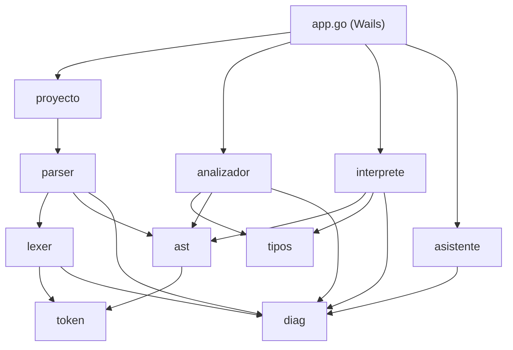
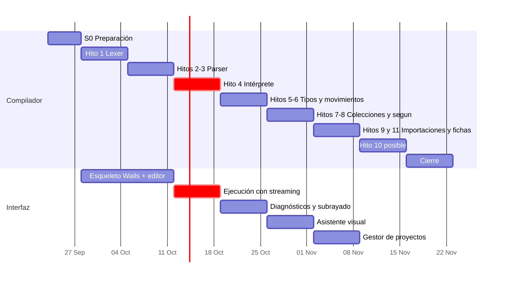
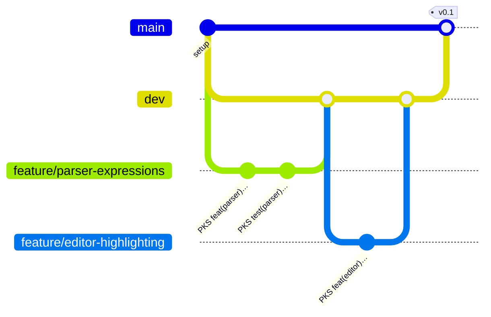

# 🗺️ Plan de implementación de PokeScript

Este es el documento de coordinación del equipo: quién hace qué, en qué orden, cómo se integra y cuándo algo se da por terminado. La especificación del lenguaje ([`PokeScript_Especificacion_Implementacion.md`](PokeScript_Especificacion_Implementacion.md)) dice **qué** construir; este plan dice **cómo** lo construimos entre los tres.

> **Regla de oro:** si este plan y la especificación se contradicen, manda la especificación. Si la especificación no dice algo, se decide en equipo y se anota en la sección [Decisiones](#-registro-de-decisiones).

---

## 📌 Índice

1. [Estado actual](#-estado-actual) ← **empieza aquí si vas a retomar el trabajo**
2. [Cómo retomar el trabajo](#-cómo-retomar-el-trabajo)
3. [Prioridades](#-prioridades)
4. [Equipo y roles](#-equipo-y-roles)
5. [Arquitectura del código](#-arquitectura-del-código)
6. [Contratos entre módulos](#-contratos-entre-módulos)
7. [Cronograma](#-cronograma)
8. [Tareas por sprint](#-tareas-por-sprint)
9. [Estrategia de pruebas](#-estrategia-de-pruebas)
10. [Flujo de trabajo en Git](#-flujo-de-trabajo-en-git)
11. [Definición de terminado](#-definición-de-terminado)
12. [Riesgos y recortes](#-riesgos-y-recortes)
13. [Preparación para la defensa](#-preparación-para-la-defensa)
14. [Registro de decisiones](#-registro-de-decisiones)

---

## 📍 Estado actual

> Última actualización: **2026-09-26**. Quien termine una tarea actualiza esta sección y marca la tarea con ✅ en su tabla, en el mismo PR.

### Resumen

| Sprint               | Estado        | Detalle                                                                                                                                                                                                                                              |
| -------------------- | ------------- | ---------------------------------------------------------------------------------------------------------------------------------------------------------------------------------------------------------------------------------------------------- |
| **S0** · Preparación | 🟡 En curso   | Contratos listos. Faltan Wails, protección de ramas en GitHub y tablero.                                                                                                                                                                             |
| **S1** · Hito 1      | 🟡 En curso   | Lexer y valores listos. Faltan el resaltado del editor y la maqueta del IDE (parte gráfica).                                                                                                                                                         |
| **S2** · Hitos 2 y 3 | ✅ Listo      | Parser completo con pila de bloques y recuperación de errores.                                                                                                                                                                                       |
| **S3** · Hito 4      | ✅ En consola | `go run ./cmd/pks ejemplos/combate` ejecuta el programa de la sección 10 desde los `.pks`. Falta el IDE.                                                                                                                                             |
| **S4** en adelante   | 🟡 En curso   | Analizador completo (pasadas 1 y 2) y proyectos con importaciones. **Los 15 casos de la sección 11 pasan: listo para `v0.2`.** Asistente (K4) y servicio (K5) listos. K6 (advertencias) listo: **el backend está completo**. Sigue la parte gráfica. |

**La parte gráfica ya empezó** en la rama `feature/ide-frontend`: `frontend/` (Svelte 5 + CodeMirror 6) corre en el navegador con un backend simulado (`frontend/src/lib/api.js`) mientras se conecta Wails. Tiene pantalla de título, la presentación del Profesor Oak con elección de compañero, el editor con resaltado por tipo, la mochila de archivos, la salida con `capturar`, el panel del compañero con los diagnósticos y cinco temas. Para verla: `pnpm --dir frontend dev`.

### ✅ Terminado

| Tarea                      | Qué quedó                                                                                                                                                                                                                      | Dónde                                                                   |
| -------------------------- | ------------------------------------------------------------------------------------------------------------------------------------------------------------------------------------------------------------------------------ | ----------------------------------------------------------------------- |
| ✅ T0.3 – T0.6             | Módulo Go, tokens, diagnósticos, nodos del AST e interfaz `ES`                                                                                                                                                                 | `internal/token`, `diag`, `ast`, `interprete/es.go`                     |
| ✅ T1.1 – T1.4             | Lexer completo con 10 tipos de error léxico en español; fuzzing sin fallos                                                                                                                                                     | `internal/lexer`                                                        |
| ✅ T1.7, T2.6, T3.1 – T3.3 | Intérprete: valores, expresiones, instrucciones, `capturar` y errores de ejecución                                                                                                                                             | `internal/interprete`                                                   |
| ✅ T2.1 – T2.5             | Parser: expresiones con precedencia, no encadenables, instrucciones, pila de bloques con pista de sangría, recuperación y límite de 20 errores                                                                                 | `internal/parser`                                                       |
| ✅ Hito 4                  | Comando de consola y ejemplos; la prueba de contrato garantiza que el parser produce el árbol de `astprueba.Seccion10()`                                                                                                       | `cmd/pks`, `ejemplos/`                                                  |
| ✅ T4.1, T5.1, T7.3        | Tipos y tablas; ejecución de colecciones y conversiones                                                                                                                                                                        | `internal/tipos`, `internal/interprete`                                 |
| ✅ K1 (T6.1, T6.2)         | Proyecto: `proyecto.json`, carga, validación de `enseñar` y ciclos con la cadena completa                                                                                                                                      | `internal/proyecto`                                                     |
| ✅ K2 (T4.2)               | Pasada 1 y `analizador.Tabla`; punto de entrada `Analizar` con registro de verificaciones; `ast.Inspeccionar`                                                                                                                  | `internal/analizador`, `internal/ast`                                   |
| ✅ J1 – J6                 | Pasada 2: tipos de expresiones, literales `{ }`, flujo, `segun`, `posible` y estrechamiento; intérprete multiarchivo                                                                                                           | `internal/analizador`, `internal/interprete`, `cmd/pks`                 |
| ✅ K3                      | Nombres y ámbitos: medalla reasignada o modificada, ocultamiento, `huir`/`siguiente` fuera de ciclo, colección modificada durante su recorrido y variable de recorrido de solo lectura                                         | `internal/analizador/nombres.go`                                        |
| ✅ Sección 11              | Prueba de integración con los 15 casos, desde el `.pks` hasta el diagnóstico                                                                                                                                                   | `cmd/pks/seccion11_test.go`                                             |
| ✅ K4 (T5.4)               | Asistente: Levenshtein con el umbral de la sección 7.1, «¿Quisiste decir …?» con `Fix` para nombres, tipos, importaciones, archivos y palabras reservadas mal escritas; 30 lecciones con ejemplos que compilan                 | `internal/asistente`                                                    |
| ✅ K5                      | Servicio `Compilar`/`Ejecutar`: une proyecto, analizador, asistente e intérprete; `cmd/pks` ya lo usa y `app.go` será solo un puente                                                                                           | `internal/servicio`                                                     |
| ✅ K6                      | Advertencias 20 a 23: dato sin usar, ciclo que no cambia, sangría inconsistente y convención de nombres; no impiden ejecutar                                                                                                   | `internal/analizador/advertencias.go`                                   |
| ✅ Capa del IDE            | Sesión de ejecución con streaming (`capturar` que va y vuelve, detener), `ResultadoCompilacion` con lecciones y símbolos para autocompletar, gestor de proyectos, menú de consulta y `Entorno` con los métodos de la sección 9 | `internal/servicio`, `internal/proyecto/gestor.go`, `internal/consulta` |

**Pruebas:** 11 paquetes en verde; 94 % de cobertura en el analizador, 97 % en el parser, 100 % en `ast` y `lexer`. golangci-lint sin problemas. **Los 15 casos de la sección 11 pasan** (`TestCasosSeccion11` y `TestProyectoSeccion10`).

### 🟡 Parcial

| Tarea   | Falta                                                                               |
| ------- | ----------------------------------------------------------------------------------- |
| 🟡 T0.1 | Wails CLI en todas las máquinas; el tercer integrante todavía no configuró la suya. |

### ⏭️ División del backend: Keylor y Jordy

Cada uno trabaja en **archivos o paquetes distintos** para avanzar al mismo tiempo sin conflictos. Los números entre paréntesis son las validaciones de la sección 4 de la especificación.

**Paso 0 (listo):** el contrato de `analizador.Tabla` está en `internal/analizador/doc.go`. Jordy lo revisa en el PR de K2 y, si algo le falta, se agrega ahí.

#### Keylor: proyecto, nombres y asistente

| #     | Tarea                                                                                                                                                                               | Dónde                        | Rama                       |
| ----- | ----------------------------------------------------------------------------------------------------------------------------------------------------------------------------------- | ---------------------------- | -------------------------- |
| ✅ K1 | Proyecto: `proyecto.json`, carga de `.pks`, `enseñar … desde`, ciclos con la cadena completa (T6.1, T6.2)                                                                           | `internal/proyecto`          | `feature/project-imports`  |
| ✅ K2 | Pasada 1: tabla de símbolos, duplicados, un solo `combate`, valores de especie únicos (T4.2)                                                                                        | `analizador/recoleccion.go`  | `feature/analyzer-symbols` |
| ✅ K3 | Nombres y ámbitos: medalla reasignada (7), ocultamiento (8), `huir`/`siguiente` fuera de ciclo (12), modificar la colección recorrida (13), asignar a la variable de recorrido (16) | `analizador/nombres.go`      | `feature/analyzer-names`   |
| ✅ K4 | Asistente: Levenshtein, `Fix` y plantillas por `Category + Code` (T5.4)                                                                                                             | `internal/asistente`         | `feature/assistant`        |
| ✅ K5 | Servicio `Compilar`/`Ejecutar` que une todo; `cmd/pks` lo usa y el futuro `app.go` será solo un puente                                                                              | `internal/servicio`          | `feature/compile-service`  |
| ✅ K6 | Advertencias 20 a 23 (prescindibles)                                                                                                                                                | `analizador/advertencias.go` | al final                   |

Casos de la sección 11: importaciones 1, 2 y 4; semántico 4.

#### Jordy: tipos y flujo

| #   | Tarea                                                                                                                                 | Dónde                      | Rama                           |
| --- | ------------------------------------------------------------------------------------------------------------------------------------- | -------------------------- | ------------------------------ |
| J1  | Pasada 2, tipos: expresiones contra la tabla (1), condiciones `electrico` (2), argumentos (3), división entre literal `0` (17) (T4.3) | `analizador/tipos_expr.go` | `feature/analyzer-types`       |
| J2  | Literales `{ }`: mochila o ficha según el tipo esperado; sin tipo esperado (14); ficha completa (15) (T6.5)                           | `analizador/literales.go`  | `feature/analyzer-literals`    |
| J3  | Flujo: asignación definida (6), retorno por todos los caminos (4), `entregar` con o sin valor (5) (T4.4, T4.5)                        | `analizador/flujo.go`      | `feature/analyzer-flow`        |
| J4  | `segun`: exhaustivo nombrando los faltantes (9), `otro` obligatorio (10), ramas inalcanzables (18) (T5.3)                             | `analizador/segun.go`      | `feature/analyzer-segun`       |
| J5  | `posible`: uso sin comprobar (11) y estrechamiento (T7.1, T7.2)                                                                       | `analizador/posible.go`    | `feature/analyzer-posible`     |
| J6  | Intérprete multiarchivo, con el archivo correcto en los errores de ejecución                                                          | `internal/interprete`      | `feature/interpreter-projects` |

Casos de la sección 11: semánticos 1, 2, 3 y 5; importación 3.

#### 🚀 Cómo empieza Jordy

Todo lo que necesita ya existe. Para cada tarea J:

1. Crea su archivo en `internal/analizador/` y se registra solo, sin tocar ningún archivo de Keylor:

   ```go
   func init() { registrar("tipos", revisarTipos) }

   func revisarTipos(c *Contexto) {
       for _, a := range c.Archivos() {
           // recorrer a.Programa y reportar con c.Error(…) o c.Advertencia(…)
       }
   }
   ```

2. Para saber qué es un nombre, usa `c.Tabla.Buscar(a.Nombre, nombre)`; para los tipos escritos, `c.Tabla.ResolverTipo(a.Nombre, tipo)`; para operar tipos, `internal/tipos` (`ResultadoOp`, `Convertible`, `Asignable`).
3. Si no necesita llevar ámbitos, recorre con `ast.Inspeccionar` / `ast.InspeccionarPrograma` (visita los 46 tipos de nodo).
4. Prueba con programas reales, sin armar árboles a mano:

   ```go
   r := analizar(t, programa("    roca x = 1 + verdadero"))
   // codigos(r.Diagnosticos) == []string{"…"}
   ```

   `analizar`, `programa` y `codigos` están en `analizador/ayudas_test.go`.

5. `go run ./cmd/pks archivo.pks` ya corre las dos pasadas: cada verificación nueva se ve en consola de inmediato.

#### Puntos de encuentro

| Cuándo            | Qué se integra                                            |
| ----------------- | --------------------------------------------------------- |
| ✅ Día 1          | Contrato de `analizador.Tabla`                            |
| ✅ K2 listo       | Jordy empieza J1 a J5 con la tabla real                   |
| ✅ K1 y J6 listos | `cmd/pks ejemplos/combate` corre con importaciones reales |
| ✅ K3 listo       | Los 15 casos de la sección 11 pasan → etiqueta `v0.2`     |

### ⚠️ Pendientes de orden

- **El tercer integrante no tiene commits.** Cuando se retome la parte gráfica, el rol A (Wails + Svelte) es suyo.
- T0.7: activar la protección de `main` y `dev` en GitHub. El hook `pre-push` ya bloquea el push directo en las máquinas del equipo.

### ⬜ Pendiente del plan

- **Backend:** completo.
- **Etiqueta `v0.2`:** integrar `dev` en `main` con un PR y etiquetar.
- **Parte gráfica (en pausa):** T0.2, T1.5, T1.6, T2.7, T3.4, T3.5 y el resto de la interfaz.
- **S0:** T0.7, T0.8.
- **Decisiones abiertas:** ninguna.

---

## 🧭 Cómo retomar el trabajo

### 1. Preparar la máquina (una sola vez)

| Herramienta                      | Versión          | Instalación en Windows                                     |
| -------------------------------- | ---------------- | ---------------------------------------------------------- |
| Go                               | 1.23 o más nueva | `winget install GoLang.Go`                                 |
| Node.js                          | 22 o más nueva   | `winget install OpenJS.NodeJS.LTS`                         |
| pnpm                             | 10 o más nueva   | `winget install pnpm.pnpm`                                 |
| Wails CLI (solo rol A por ahora) | v2               | `go install github.com/wailsapp/wails/v2/cmd/wails@latest` |

Después de instalar, **cierra y abre la terminal** para que reconozca `go` y `pnpm`.

> ⚠️ **El proyecto usa solo pnpm.** `npm install` y `yarn` están bloqueados a propósito: el script `preinstall` los detiene con un mensaje. Nunca subas un `package-lock.json`.

```bash
git clone https://github.com/keylorpineda/PokeScript.git
cd PokeScript
pnpm install
git config commit.template .gitmessage
```

### 2. Comprobar que todo funciona

```bash
go test ./internal/...
```

```bash
pnpm lint
```

Las dos deben terminar sin errores. Si `go test` falla en una máquina nueva, avisa en el grupo antes de tocar código.

### 3. Mapa del código que ya existe

| Paquete               | Punto de entrada                                               | Para qué lo vas a usar                                     |
| --------------------- | -------------------------------------------------------------- | ---------------------------------------------------------- |
| `internal/token`      | `token.Token`, `token.Kind`, `token.Buscar(palabra)`           | El parser compara `tok.Kind == token.SI`, etc.             |
| `internal/diag`       | `diag.Diagnostic`, `diag.Lista{Max: 20}`                       | Todos los errores del compilador y del intérprete          |
| `internal/lexer`      | `lexer.Analizar(archivo, fuente) Resultado`                    | Entrada del parser: `Resultado.Tokens`                     |
| `internal/ast`        | `ast.Programa`, `ast.Expr`, `ast.Instr`, `ast.DesdeToken(tok)` | Salida del parser, entrada del analizador y del intérprete |
| `internal/interprete` | `interprete.ES`, `interprete.NuevaESMemoria(...)`              | Salida de `gritar` y entrada de `capturar`, sin Wails      |

### 4. Cosas que conviene saber antes de programar

- **`a`, `y`, `o`, `de` y `en` son palabras reservadas.** No las uses como nombres de variables, tampoco en las pruebas.
- **Las posiciones se cuentan en caracteres (runas), no en bytes**, para que `año` no descuadre el subrayado. Usa `ast.DesdeToken(tok)` para pasar la posición de un token a un nodo.
- En `PLANTA_LIT` y `FUEGO_LIT`, `tok.Lexeme` ya es el valor final: sin comillas y con los escapes resueltos.
- **Un token `ILLEGAL` ya fue reportado por el lexer.** El parser lo salta sin reportar otro error.
- Los símbolos de otros lenguajes (`==`, `&&`, `%`…) llegan al parser ya convertidos en `IGUAL`, `Y`, `RESTO`… y con su error léxico reportado.
- Todo archivo con código termina en `NEWLINE` antes de `EOF`, aunque le falte el salto de línea final.
- Los 4 archivos de la sección 10 están en `internal/lexer/testdata/`. Sirven como prueba de integración del parser también.
- Para probar el lexer con entradas al azar: `go test -fuzz=FuzzAnalizar -fuzztime=30s ./internal/lexer/`

### 5. Al terminar una tarea

1. Marca la tarea con ✅ en su tabla de [Tareas por sprint](#-tareas-por-sprint).
2. Actualiza la sección [Estado actual](#-estado-actual): mueve la tarea a "Terminado" y ajusta "Siguientes tareas".
3. Si tomaste una decisión que la especificación no define, anota la decisión en el [registro](#-registro-de-decisiones).
4. Abre el PR hacia `dev` con el ID de la tarea en el título.

---

## 🎯 Prioridades

Lo que vale la nota, en orden:

| #   | Prioridad                                                  | Por qué                                                                                     |
| --- | ---------------------------------------------------------- | ------------------------------------------------------------------------------------------- |
| 1   | **Llegar al hito 4** (primer programa corriendo en el IDE) | Convierte el proyecto en algo demostrable. Todo lo demás se construye encima.               |
| 2   | **Commits de los tres, desde ya**                          | Es 5 % de la nota y no se recupera después. Cada integrante hace commits todas las semanas. |
| 3   | **El diagnóstico de bloque sin cerrar**                    | Es el diagnóstico estrella del lenguaje. Va en el sprint del parser, no al final.           |
| 4   | **Asistente con distancia de edición**                     | Es barato y es la innovación. No se deja de último.                                         |
| 5   | **Que cada integrante pueda explicar todo el sistema**     | La defensa (25 %) es **individual**.                                                        |

El aplicativo vale 35 % y la defensa 25 %. La documentación ya está casi lista: **el riesgo está todo en el código**.

---

## 👥 Equipo y roles

Cada rol es **dueño** de un área, pero no trabaja solo en ella: todo PR lo revisa otra persona, y los roles rotan en las tareas de revisión para que los tres conozcan todo el sistema.

| Rol                            | Integrante    | Área principal                                                           | Paquetes                                                                            |
| ------------------------------ | ------------- | ------------------------------------------------------------------------ | ----------------------------------------------------------------------------------- |
| **A · Interfaz**               | _por asignar_ | Wails, Svelte, CodeMirror, gestor de proyectos, salida, asistente visual | `frontend/`, `app.go`, `main.go`                                                    |
| **B · Frontal del compilador** | _por asignar_ | Tokens, lexer, AST, parser, recuperación de errores, pila de bloques     | `internal/token`, `internal/lexer`, `internal/ast`, `internal/parser`               |
| **C · Semántica y ejecución**  | _por asignar_ | Intérprete, sistema de tipos, analizador, importaciones                  | `internal/interprete`, `internal/tipos`, `internal/analizador`, `internal/proyecto` |

**Áreas compartidas:**

- `internal/diag` (diagnósticos): lo define **B** en el sprint 0, lo usan todos.
- `internal/asistente`: lo implementa **A** (reglas y Levenshtein) con apoyo de **C** (tabla de símbolos).
- `testdata/` y casos de prueba de la sección 11: cada dueño escribe los de su área; **C** mantiene la prueba completa del programa de la sección 10.

> ✏️ Anoten sus nombres en la tabla en el primer commit de cada uno. Es un buen primer commit: `PKS docs: assign team roles in plan`.

---

## 🧱 Arquitectura del código

### Estructura de carpetas

```text
PokeScript/
├── main.go                     ← arranque de Wails
├── app.go                      ← métodos expuestos a Svelte (puente)
├── go.mod
├── internal/
│   ├── token/                  ← TokenKind, Token, palabras reservadas
│   ├── lexer/                  ← texto → []Token
│   ├── ast/                    ← nodos del árbol (todos con Line/Col/Len)
│   ├── parser/                 ← []Token → *ast.Programa + []Diagnostic
│   ├── diag/                   ← Diagnostic, Fix, encabezados temáticos
│   ├── tipos/                  ← Type, tabla de efectividades, operaciones
│   ├── analizador/             ← tabla de símbolos, 2 pasadas, validaciones
│   ├── interprete/             ← valores en ejecución y evaluación del AST
│   ├── proyecto/               ← proyecto.json, archivos .pks, grafo de importaciones
│   └── asistente/              ← explicaciones y sugerencias (Levenshtein)
├── frontend/                   ← Svelte + CodeMirror 6
│   └── src/
│       ├── lib/editor/         ← lenguaje PokeScript para CodeMirror, subrayados
│       ├── lib/paneles/        ← salida, diagnósticos, asistente, consulta
│       └── lib/estado.js       ← stores: proyecto, archivoActivo, diagnosticos…
├── ejemplos/                   ← proyectos de ejemplo (.pks + proyecto.json)
└── docs/
```

### Reglas de dependencia



- **Nada dentro de `internal/` importa Wails.** Así todo se prueba con `go test` sin interfaz, y el CI no necesita instalar GTK ni WebKit.
- Las flechas van en un solo sentido: `lexer` no conoce al `parser`, el `parser` no conoce al `analizador`, etc.
- El único que conoce a todos es `app.go`.

---

## 🤝 Contratos entre módulos

Estos tipos se acuerdan **en el sprint 0**, antes de que cada quien arranque su parte. Mientras el contrato no cambie, los tres pueden trabajar en paralelo. Cambiar un contrato requiere avisar en el grupo y un PR revisado por los otros dos.

### `internal/token`

```go
type Token struct {
    Kind   Kind
    Lexeme string
    Line   int // base 1
    Col    int // base 1
    Len    int // en runas, para el subrayado
}
```

### `internal/diag`

```go
type Diagnostic struct {
    Severity string // "error" | "advertencia"
    Category string // "lexico" | "sintactico" | "semantico" | "importacion" | "ejecucion"
    Code     string // subcódigo estable, ej. "bloque-sin-cerrar", "tipo-incompatible"
    Heading  string // "¡Se escapó!", "No es muy efectivo…", …
    File     string
    Line, Col, Len int
    Desc, Cause, Suggest string
    Fix      *Fix
}
```

El campo `Code` no está en la especificación: lo agregamos para que el asistente tenga una clave estable (`Category + Code`) con la que buscar su plantilla de explicación. Ver [Decisiones](#-registro-de-decisiones).

### `internal/ast`

Todos los nodos llevan su posición. La propuesta base:

```go
type Pos struct{ Line, Col, Len int }

type Nodo interface{ Posicion() Pos }
type Expr interface{ Nodo; expr() }
type Instr interface{ Nodo; instr() }
```

**B** escribe la lista completa de nodos (uno por regla de la gramática) en el sprint 0 y **C** la revisa, porque el intérprete y el analizador la recorren.

### `internal/interprete`: entrada y salida

El intérprete **no sabe** que existe Wails. Recibe una interfaz:

```go
type ES interface {
    Escribir(linea string)                 // gritar
    Leer(prompt string) (string, error)    // capturar: bloquea hasta recibir texto
}
```

- En las pruebas: una implementación falsa que guarda la salida en un `[]string` y responde entradas desde una lista.
- En la app: `app.go` implementa `ES` con `runtime.EventsEmit` para la salida y un canal que se llena con `EnviarEntrada`.
- La ejecución corre en una goroutine y recibe un `context.Context` para poder detenerla desde el botón de la interfaz.

### Puente Wails (`app.go`)

**Todo el backend del IDE ya existe y está probado.** `app.go` solo envuelve estas funciones; cada método de Wails es una o dos líneas.

| Método de `app.go`                                                                                                                                        | Llama a                                  | Devuelve                                                                                                                                            |
| --------------------------------------------------------------------------------------------------------------------------------------------------------- | ---------------------------------------- | --------------------------------------------------------------------------------------------------------------------------------------------------- |
| `CompilarProyecto(ruta)`                                                                                                                                  | `entorno.CompilarProyecto`               | `servicio.ResultadoCompilacion`: éxito, encabezado, diagnósticos con su `Fix` y su lección, y los símbolos de cada archivo para autocompletar       |
| `EjecutarProyecto(ruta)`                                                                                                                                  | `entorno.EjecutarProyecto(ruta, emitir)` | La compilación. La salida llega por eventos: `salida`, `pedir-entrada`, `error-ejecucion` y `fin-ejecucion` (con `terminado`, `detenido` o `error`) |
| `EnviarEntrada(texto)`                                                                                                                                    | `entorno.EnviarEntrada`                  | Error si el programa no está en un `capturar`                                                                                                       |
| `DetenerEjecucion()`                                                                                                                                      | `entorno.DetenerEjecucion`               | —                                                                                                                                                   |
| `ObtenerTablaEfectividades()`                                                                                                                             | `consulta.TablaEfectividades`            | `[][]string` con encabezados                                                                                                                        |
| `ObtenerPalabrasReservadas()`                                                                                                                             | `consulta.PalabrasReservadas`            | `[]consulta.PalabraDoc`: palabra, grupo, descripción y ejemplo                                                                                      |
| `CrearProyecto(carpeta, nombre)`, `LeerProyecto`, `LeerArchivo`, `GuardarArchivo`, `NuevoArchivo`, `RenombrarArchivo`, `BorrarArchivo`, `MarcarPrincipal` | `proyecto.Crear`, `Leer`, …              | Gestor de proyectos                                                                                                                                 |

El `emitir` de `EjecutarProyecto` es `func(e servicio.Evento) { runtime.EventsEmit(a.ctx, e.Tipo, e) }`. Los tipos con etiquetas JSON (`ResultadoCompilacion`, `Evento`, `PalabraDoc`, `proyecto.Info`) viajan a Svelte tal cual.

---

## 📅 Cronograma

Sprints de una semana, de lunes a domingo. **Ajusten las fechas a la fecha real de entrega del enunciado**: si la entrega es antes, se recortan primero las tareas marcadas como _prescindibles_.

| Sprint | Fechas         | Hitos       | Meta demostrable                                            |
| ------ | -------------- | ----------- | ----------------------------------------------------------- |
| **S0** | 23 – 27 sep    | Preparación | Proyecto Wails abre, CI en verde, contratos acordados       |
| **S1** | 28 sep – 4 oct | 1           | Lexer completo; el editor colorea código PokeScript         |
| **S2** | 5 – 11 oct     | 2, 3        | Parser completo; diagnóstico de bloque sin cerrar           |
| **S3** | 12 – 18 oct    | 4           | 🏁 **Primer programa corriendo en el IDE** (`v0.1`)         |
| **S4** | 19 – 25 oct    | 5, 6        | Errores de tipos y movimientos con parámetros               |
| **S5** | 26 oct – 1 nov | 7, 8, 12    | Colecciones, `segun` exhaustivo y asistente básico (`v0.2`) |
| **S6** | 2 – 8 nov      | 9, 11       | Proyectos de varios archivos y fichas                       |
| **S7** | 9 – 15 nov     | 10          | Programa de la sección 10 corre completo (`v0.3`)           |
| **S8** | 16 – 22 nov    | Cierre      | Pulido, pruebas, manual, ensayo de defensa (`v1.0`)         |



---

## 📋 Tareas por sprint

Cada tarea tiene un identificador (`T1.3`) para usarlo en el título del PR. Responsable: **A**, **B** o **C**.

### S0 · Preparación (23 – 27 sep)

| ID      | Tarea                                                                                                                                                                  | Resp.          | Listo cuando                       |
| ------- | ---------------------------------------------------------------------------------------------------------------------------------------------------------------------- | -------------- | ---------------------------------- |
| 🟡 T0.1 | Instalar Go ≥ 1.23, Node ≥ 22, pnpm ≥ 10 y Wails CLI v2; correr `wails doctor` sin errores                                                                             | Todos          | Cada quien lo confirma en el grupo |
| T0.2    | `wails init -n PokeScript -t svelte` e integrarlo a la estructura del repo (raíz Go + `frontend/`), con `pnpm` en `wails.json` (`frontend:install` y `frontend:build`) | A              | `wails dev` abre una ventana       |
| ✅ T0.3 | Crear `go.mod` y los paquetes vacíos de `internal/` con un `doc.go` cada uno                                                                                           | B              | `go build ./...` y el CI pasan     |
| ✅ T0.4 | Escribir `internal/token` (todos los `Kind`, tabla de 48 palabras reservadas) y `internal/diag`                                                                        | B              | Revisado por A y C                 |
| ✅ T0.5 | Proponer la lista de nodos de `internal/ast`                                                                                                                           | B              | Revisado por C                     |
| ✅ T0.6 | Proponer la interfaz `ES` y los nombres de eventos de Wails                                                                                                            | C              | Revisado por A                     |
| T0.7    | Proteger `main` y `dev` en GitHub (PR obligatorio + CI en verde)                                                                                                       | Dueño del repo | Push directo a `dev` rechazado     |
| T0.8    | Crear el tablero en GitHub Projects con las tareas de este plan                                                                                                        | Todos          | Cada tarea tiene su tarjeta        |

### S1 · Hito 1: lexer (28 sep – 4 oct)

| ID      | Tarea                                                                                                                      | Resp. | Listo cuando                                          |
| ------- | -------------------------------------------------------------------------------------------------------------------------- | ----- | ----------------------------------------------------- |
| ✅ T1.1 | Lexer: identificadores con `ñ` y tildes, palabras reservadas, números `roca`/`agua`                                        | B     | Pruebas de tabla pasan                                |
| ✅ T1.2 | Lexer: `fuego`, `planta` con escapes `\"` `\n` `\\`; escape desconocido = error léxico                                     | B     | Incluye caso "cadena sin cerrar" (sección 11)         |
| ✅ T1.3 | Lexer: `sino si` como `SINO_SI`, punto de `6.9` vs `chispo.vida`, `//` comentarios                                         | B     | Pruebas de los casos ambiguos                         |
| ✅ T1.4 | Lexer: `NEWLINE` significativo, líneas en blanco y comentarios sin `NEWLINE` propio, columna inicial de cada línea         | B     | Pruebas                                               |
| T1.5    | Resaltado en CodeMirror 6 con `StreamLanguage` (categorías: reservada, tipo, literal, identificador, comentario, operador) | A     | Los ejemplos del README se ven coloreados             |
| T1.6    | Diseño base del IDE: editor, panel de salida, panel de diagnósticos, barra con Compilar / Ejecutar                         | A     | Maqueta funcional (botones aún sin lógica)            |
| ✅ T1.7 | `internal/interprete`: tipos de valores en ejecución (sección 3.4), incluida la mochila con orden de inserción             | C     | Pruebas de la mochila ordenada y de la copia profunda |

### S2 · Hitos 2 y 3: parser (5 – 11 oct)

| ID      | Tarea                                                                                                                         | Resp. | Listo cuando                                                      |
| ------- | ----------------------------------------------------------------------------------------------------------------------------- | ----- | ----------------------------------------------------------------- |
| ✅ T2.1 | Parser de expresiones con la jerarquía `expr_o` → `expr_acceso`; `2 + 3 * 4` da el árbol correcto                             | B     | Pruebas de precedencia                                            |
| ✅ T2.2 | Operadores no encadenables: `a > b > c` es error sintáctico                                                                   | B     | Caso de la sección 11                                             |
| ✅ T2.3 | Parser de instrucciones y bloques, anticipación de 2 tokens, retroceso en `decl_dato`                                         | B     | Árbol completo de los 4 archivos de la sección 10                 |
| ✅ T2.4 | ⭐ Pila de bloques: el error dice **en qué línea se abrió** el bloque sin `fin`                                               | B     | Caso "falta un `fin`" de la sección 11                            |
| ✅ T2.5 | Recuperación hasta el siguiente `NEWLINE`, máximo 20 diagnósticos                                                             | B     | Casos "dos instrucciones en una línea" y "`recorrer` sin `hasta`" |
| ✅ T2.6 | Intérprete: evaluar expresiones sobre un AST (aritmética, comparación, `y`/`o` en cortocircuito)                              | C     | Pruebas con AST armados a mano, sin esperar al parser             |
| T2.7    | Método `CompilarProyecto` en `app.go` (por ahora solo lexer + parser) y subrayado de errores en CodeMirror con `Line/Col/Len` | A     | Un error de sintaxis se subraya en el editor                      |

### S3 · Hito 4: primer programa corriendo (12 – 18 oct) 🏁

| ID      | Tarea                                                                                                                    | Resp. | Listo cuando                                           |
| ------- | ------------------------------------------------------------------------------------------------------------------------ | ----- | ------------------------------------------------------ |
| ✅ T3.1 | Intérprete: variables, asignación, `gritar`, `si`/`sino si`/`sino`, `mientras`, `recorrer` de rango, `huir`, `siguiente` | C     | Pruebas con programas `.pks` en `testdata/`            |
| ✅ T3.2 | Intérprete: `capturar` usando la interfaz `ES`                                                                           | C     | Prueba con entrada simulada                            |
| ✅ T3.3 | Errores de ejecución: división entre cero, desbordamiento de `roca`                                                      | C     | Diagnóstico `¡Falló el ataque!` con línea              |
| T3.4    | `EjecutarProyecto` con streaming por eventos, `EnviarEntrada` y `DetenerEjecucion`                                       | A + C | En el IDE: `capturar` pide un dato y el programa sigue |
| T3.5    | Panel de salida con caja de entrada cuando el programa espera `capturar`                                                 | A     | Demo en vivo                                           |
| T3.6    | Etiqueta `v0.1` en `main` y video corto de la demo                                                                       | Todos | Tag publicado                                          |

### S4 · Hitos 5 y 6: tipos y movimientos (19 – 25 oct)

| ID      | Tarea                                                                                                                    | Resp. | Listo cuando                            |
| ------- | ------------------------------------------------------------------------------------------------------------------------ | ----- | --------------------------------------- |
| ✅ T4.1 | `internal/tipos`: `Type`, tabla de efectividades, tabla de operaciones (secciones 3.2 y 3.3)                             | C     | Pruebas celda por celda                 |
| T4.2    | Analizador, pasada 1: tabla de símbolos, medallas, cabeceras de movimientos, un solo `combate`                           | C     | Pruebas                                 |
| T4.3    | Analizador, pasada 2: tipos de expresiones, condiciones `electrico`, reasignación de `medalla`, ocultamiento             | C     | Casos semánticos 1 y 4 de la sección 11 |
| T4.4    | Asignación definida (sección 4.2)                                                                                        | B     | Caso semántico 5 de la sección 11       |
| 🟡 T4.5 | Movimientos: parámetros por valor con copia profunda, `entregar`, retorno por todos los caminos, límite de 1000 llamadas | C     | Pruebas de recursión y de copia         |
| T4.6    | Diagnósticos con encabezados temáticos y panel de diagnósticos navegable (clic → salta a la línea)                       | A     | Demo                                    |

### S5 · Hitos 7, 8 y 12: colecciones, `segun` y asistente (26 oct – 1 nov)

| ID      | Tarea                                                                                                                          | Resp. | Listo cuando                                                 |
| ------- | ------------------------------------------------------------------------------------------------------------------------------ | ----- | ------------------------------------------------------------ |
| ✅ T5.1 | `equipo` y `mochila`: literales, acceso `[ ]` desde 1, `sumar`, `quitar`, `contiene`, `tamaño`, `recorrer` con 1 y 2 variables | C     | Pruebas, incluidos índice fuera de rango y clave inexistente |
| T5.2    | Prohibido modificar la colección que se recorre; la variable de recorrido es de solo lectura                                   | B     | Pruebas                                                      |
| T5.3    | `especie` y `segun`: exhaustivo **nombrando los faltantes**, `otro` obligatorio en tipos abiertos, ramas inalcanzables         | B     | Caso semántico 2 de la sección 11                            |
| T5.4    | Asistente: plantillas por `Category + Code` y sugerencia por Levenshtein (distancia ≤ 2 o ≤ 1/3 de la longitud)                | A     | Escribir `curra(vida)` sugiere `curar`                       |
| T5.5    | Botón "Aplicar arreglo" en el editor (`Fix` → `dispatch`)                                                                      | A     | Demo                                                         |
| T5.6    | Etiqueta `v0.2`                                                                                                                | Todos | Tag publicado                                                |

### S6 · Hitos 9 y 11: importaciones y fichas (2 – 8 nov)

| ID   | Tarea                                                                                                     | Resp. | Listo cuando                                |
| ---- | --------------------------------------------------------------------------------------------------------- | ----- | ------------------------------------------- |
| T6.1 | `internal/proyecto`: leer `proyecto.json`, cargar los `.pks`, resolver `enseñar … desde`                  | C     | Casos de importación 1 y 2 de la sección 11 |
| T6.2 | Grafo de dependencias y detección de ciclos con **la cadena completa**                                    | C     | Caso `a.pks → b.pks → a.pks`                |
| T6.3 | Tipos de argumentos en movimientos importados                                                             | C     | Caso de importación 3                       |
| T6.4 | `ficha`: declaración, literal (completo, sin repetir, sin campos ajenos), acceso con `.`                  | B     | Pruebas                                     |
| T6.5 | Resolver `{ }` como mochila o ficha según el tipo esperado                                                | B     | Pruebas de ambos casos                      |
| T6.6 | Gestor de proyectos en la interfaz: abrir/crear carpeta, árbol de archivos, pestañas, marcar el principal | A     | Demo con el proyecto de la sección 10       |

### S7 · Hito 10: `posible` y programa completo (9 – 15 nov)

| ID      | Tarea                                                                                            | Resp. | Listo cuando                         |
| ------- | ------------------------------------------------------------------------------------------------ | ----- | ------------------------------------ |
| T7.1    | `posible` y su literal nulo, operador `sino` de respaldo                                         | B     | Pruebas                              |
| T7.2    | Estrechamiento con `igual`/`diferente` contra el nulo, propagación por `y`, pérdida al reasignar | B     | Caso semántico 3 de la sección 11    |
| ✅ T7.3 | `convertir`, `redondear` y `aleatorio` completos, con sus errores de ejecución                   | C     | Pruebas                              |
| T7.4    | 🏆 El programa de la sección 10 corre completo en el IDE                                         | Todos | Prueba de integración en `ejemplos/` |
| T7.5    | Menú de consulta: tabla de efectividades y palabras reservadas                                   | A     | Demo                                 |
| T7.6    | Etiqueta `v0.3`                                                                                  | Todos | Tag publicado                        |

### S8 · Cierre (16 – 22 nov)

| ID   | Tarea                                                                              | Resp. | Listo cuando                                 |
| ---- | ---------------------------------------------------------------------------------- | ----- | -------------------------------------------- |
| T8.1 | Correr los 15 casos de la sección 11 y el programa completo; corregir lo que falle | Todos | Todos pasan en el CI                         |
| T8.2 | Advertencias 18 a 23 de la sección 4 (las 20 a 23 son _prescindibles_)             | B + C | 18 y 19 hechas; 20 a 23 solo si sobra tiempo |
| T8.3 | Sonidos con Howler.js (compilación exitosa, error, captura)                        | A     | _Prescindible_                               |
| T8.4 | Proyecto de ejemplo del entregable y manual de usuario                             | A     | Revisado por B y C                           |
| T8.5 | Compilar el ejecutable final con `wails build` para Windows                        | A     | El `.exe` corre en otra máquina              |
| T8.6 | Ensayo de defensa cruzada (ver abajo)                                              | Todos | Cada quien explica un módulo que no hizo     |
| T8.7 | Etiqueta `v1.0` en `main`                                                          | Todos | Tag publicado                                |

---

## 🧪 Estrategia de pruebas

### Pruebas unitarias en Go

- Un archivo `*_test.go` junto a cada archivo de código, con **pruebas de tabla**.
- `go test ./internal/...` debe pasar antes de abrir un PR. El CI lo repite con `-race`.

### Pruebas de programas completos (golden files)

Cada caso vive en `testdata/` dentro del paquete que lo prueba:

```text
internal/interprete/testdata/
├── hola_mundo.pks          ← programa
├── hola_mundo.entrada      ← (opcional) respuestas para capturar, una por línea
└── hola_mundo.salida       ← salida esperada exacta

internal/analizador/testdata/
├── segun_incompleto.pks
└── segun_incompleto.diag   ← diagnósticos esperados: línea:col categoría código
```

Un solo `TestProgramas` recorre la carpeta, ejecuta cada `.pks` y compara con el archivo esperado. Agregar un caso nuevo es agregar dos archivos, sin tocar código.

### Casos obligatorios (sección 11 de la especificación)

| Caso                                                     | Sprint | Resp. |
| -------------------------------------------------------- | ------ | ----- |
| Sintáctico 1 · falta un `fin` (indica línea de apertura) | S2     | B     |
| Sintáctico 2 · `a > b > c`                               | S2     | B     |
| Sintáctico 3 · dos instrucciones en una línea            | S2     | B     |
| Sintáctico 4 · cadena sin cerrar                         | S1     | B     |
| Sintáctico 5 · `recorrer n de 1 a 10`                    | S2     | B     |
| Semántico 1 · `roca + electrico`                         | S4     | C     |
| Semántico 2 · `segun` con un valor sin cubrir            | S5     | B     |
| Semántico 3 · `posible` sin comprobar                    | S7     | B     |
| Semántico 4 · reasignación de `medalla`                  | S4     | C     |
| Semántico 5 · dato leído sin valor                       | S4     | B     |
| Importación 1 · archivo inexistente                      | S6     | C     |
| Importación 2 · nombre inexistente en el archivo         | S6     | C     |
| Importación 3 · argumentos de tipo incorrecto            | S6     | C     |
| Importación 4 · ciclo con la cadena completa             | S6     | C     |
| Prueba completa · programa de la sección 10              | S7     | Todos |

### Interfaz

Sin pruebas automáticas en la interfaz (no alcanza el tiempo). Cada PR de **A** incluye una captura o un GIF corto de lo que cambió.

---

## 🌿 Flujo de trabajo en Git



1. Cada tarea sale en su propia rama desde `dev`, con nombre **en inglés** que diga qué se hace: `<tipo>/<área>-<qué>`, en minúsculas y con guiones.
   - `feature/…` para funcionalidad nueva: `feature/parser-expressions`, `feature/editor-highlighting`, `feature/interpreter-loops`.
   - `fix/…` para correcciones: `fix/lexer-string-escapes`.
   - `docs/…`, `test/…` o `chore/…` cuando no hay código de producto: `docs/user-manual`, `chore/ci-cache`.
2. Commits pequeños, con el formato `PKS type(scope): description` en inglés (ver [CONTRIBUTING.md](../CONTRIBUTING.md)).
3. PR hacia `dev` con el ID de la tarea en el título, por ejemplo `T2.1 Parse expressions with precedence`. El ID va en el PR, no en la rama. **Lo revisa al menos otra persona.** El CI debe estar en verde.
4. Merge con **merge commit** (no squash), para que los commits de cada integrante queden en el historial.
5. Al cerrar cada hito demostrable, PR de `dev` a `main` y etiqueta (`v0.1`, `v0.2`, …).

**Reglas de convivencia:**

- Nadie hace push directo a `dev` ni a `main`.
- Un PR abierto más de 2 días sin revisión se menciona en el grupo.
- Antes de empezar el día: `git pull` en `dev` y rebase de la rama propia.
- Si una tarea bloquea a otra persona, esa tarea tiene prioridad.

### Reunión semanal (30 min)

Al inicio de cada sprint (lunes):

1. Demo de lo que se terminó en el sprint anterior.
2. Revisión del tablero: qué quedó pendiente y por qué.
3. Asignar las tareas del sprint nuevo.
4. Anotar cualquier decisión en el [registro](#-registro-de-decisiones).

---

## ✅ Definición de terminado

Una tarea está terminada cuando:

- [ ] El código está en `dev` mediante un PR revisado por otra persona.
- [ ] El CI está en verde (commitlint, formato, ortografía, `go vet`, pruebas).
- [ ] Tiene pruebas (Go) o captura/GIF (interfaz).
- [ ] Los diagnósticos que produce llevan `Line`, `Col` y `Len` correctos y están en español con su encabezado temático.
- [ ] Si cambió un contrato, los otros dos lo aprobaron.
- [ ] La tarjeta del tablero está en "Hecho".

---

## 🚧 Riesgos y recortes

| Riesgo                                       | Probabilidad | Plan                                                                                                   |
| -------------------------------------------- | ------------ | ------------------------------------------------------------------------------------------------------ |
| No llegar al hito 4 a tiempo                 | Media        | El intérprete (C) arranca en S1 con AST armados a mano, sin esperar al parser.                         |
| El puente Wails con `capturar` se complica   | Media        | La interfaz `ES` aísla el problema; se prueba primero con una versión de consola (`go run ./cmd/pks`). |
| Un integrante se atrasa                      | Media        | Las tareas de cada sprint se revisan el lunes; se redistribuyen sin esperar.                           |
| La gramática tiene ambigüedades no previstas | Baja         | Se resuelve en equipo y se anota en el registro de decisiones.                                         |
| Poco tiempo al final                         | Alta         | Se recortan en este orden: advertencias 20–23 → sonidos → PixiJS → advertencias 18–19.                 |

**Lo que no se recorta nunca:** hito 4, diagnóstico de bloque sin cerrar, asistente con Levenshtein, los 15 casos de la sección 11 y el programa de la sección 10.

### Herramienta de consola (recomendada)

Además del IDE, un comando mínimo en `cmd/pks/main.go` que compila y ejecuta un proyecto desde la terminal:

```bash
go run ./cmd/pks ejemplos/combate
```

Sirve para probar el compilador sin abrir Wails y es un plan B para la demo si la interfaz falla.

---

## 🎤 Preparación para la defensa

La defensa es individual: cualquiera puede recibir preguntas sobre cualquier parte. Para eso:

- **Revisiones cruzadas:** A revisa PRs de B y C, B revisa de C y A, C revisa de A y B. Revisar incluye poder explicar el cambio.
- **Explicación rotativa:** en cada reunión semanal, alguien explica en 5 minutos un módulo que **no** escribió.
- **Preguntas que cada integrante debe poder responder:**
  - ¿Cómo distingue el lexer `6.9` de `chispo.vida`?
  - ¿Cómo se implementa la precedencia de operadores en el parser?
  - ¿Cómo sabe el parser en qué línea se abrió un bloque sin cerrar?
  - ¿Por qué `{ }` se resuelve en el analizador y no en el parser?
  - ¿Cómo funciona la asignación definida?
  - ¿Cómo se verifica que un `segun` sea exhaustivo?
  - ¿Por qué la mochila no puede ser un `map` de Go?
  - ¿Cómo viaja un `capturar` desde Go hasta Svelte y de vuelta?
  - ¿Cómo elige el asistente la sugerencia con distancia de edición?
  - ¿Cómo se detecta un ciclo de importaciones?

---

## 📝 Registro de decisiones

Todo lo que la especificación no define y el equipo decide. Formato: fecha, decisión, motivo.

| Fecha      | Decisión                                                                                                                                                                                                                                                                                                                                                                                                                                                                                                                                                                                                                                                                                                                                                                                                                                                                         | Motivo                                                                                                                        |
| ---------- | -------------------------------------------------------------------------------------------------------------------------------------------------------------------------------------------------------------------------------------------------------------------------------------------------------------------------------------------------------------------------------------------------------------------------------------------------------------------------------------------------------------------------------------------------------------------------------------------------------------------------------------------------------------------------------------------------------------------------------------------------------------------------------------------------------------------------------------------------------------------------------- | ----------------------------------------------------------------------------------------------------------------------------- |
| 2026-09-23 | El compilador vive en `internal/` y no importa Wails                                                                                                                                                                                                                                                                                                                                                                                                                                                                                                                                                                                                                                                                                                                                                                                                                             | Se prueba con `go test` y el CI no necesita la interfaz                                                                       |
| 2026-09-23 | Se agrega el campo `Code` a `Diagnostic`                                                                                                                                                                                                                                                                                                                                                                                                                                                                                                                                                                                                                                                                                                                                                                                                                                         | Clave estable para las plantillas del asistente                                                                               |
| 2026-09-23 | El intérprete recibe la interfaz `ES` para `gritar` y `capturar`                                                                                                                                                                                                                                                                                                                                                                                                                                                                                                                                                                                                                                                                                                                                                                                                                 | Permite probarlo sin interfaz y conectar Wails por eventos                                                                    |
| 2026-09-23 | Merge commits (no squash) de las ramas a `dev`                                                                                                                                                                                                                                                                                                                                                                                                                                                                                                                                                                                                                                                                                                                                                                                                                                   | Conservar los commits de cada integrante                                                                                      |
| 2026-09-23 | `go.mod` declara `go 1.23`, aunque se desarrolle con una versión más nueva                                                                                                                                                                                                                                                                                                                                                                                                                                                                                                                                                                                                                                                                                                                                                                                                       | El CI instala esa versión y nadie usa algo que los demás no tengan                                                            |
| 2026-09-23 | Linter `misspell` desactivado en golangci-lint                                                                                                                                                                                                                                                                                                                                                                                                                                                                                                                                                                                                                                                                                                                                                                                                                                   | Solo conoce inglés y marca los comentarios en español; CSpell revisa ambos idiomas                                            |
| 2026-09-23 | Solo pnpm como gestor de paquetes; `npm` y `yarn` quedan bloqueados por `preinstall`                                                                                                                                                                                                                                                                                                                                                                                                                                                                                                                                                                                                                                                                                                                                                                                             | Un solo lockfile (`pnpm-lock.yaml`) y las mismas versiones en las tres máquinas y en el CI                                    |
| 2026-09-23 | En `fuego` se aceptan los escapes `\'` `\n` `\\`                                                                                                                                                                                                                                                                                                                                                                                                                                                                                                                                                                                                                                                                                                                                                                                                                                 | La especificación solo define los de `planta`; sin `\'` no se puede escribir una comilla simple                               |
| 2026-09-23 | En `PLANTA_LIT` y `FUEGO_LIT`, `Lexeme` guarda el valor ya decodificado                                                                                                                                                                                                                                                                                                                                                                                                                                                                                                                                                                                                                                                                                                                                                                                                          | El parser no repite el manejo de escapes; `Col` y `Len` siguen apuntando al texto original                                    |
| 2026-09-23 | `==`, `!=`, `&&`, `\|\|` y `%` son error léxico, pero el lexer emite `igual`, `diferente`, `y`, `o` y `resto`                                                                                                                                                                                                                                                                                                                                                                                                                                                                                                                                                                                                                                                                                                                                                                    | Explica el error de quien viene de otro lenguaje y el parser puede seguir sin errores en cascada                              |
| 2026-09-23 | Un token `ILLEGAL` ya fue reportado por el lexer; el parser lo salta sin reportarlo otra vez                                                                                                                                                                                                                                                                                                                                                                                                                                                                                                                                                                                                                                                                                                                                                                                     | Evita diagnósticos duplicados                                                                                                 |
| 2026-09-24 | P1: dentro de una colección, los valores se muestran como literales del lenguaje (`["Pikachu"]`, `['a']`, `{nombre: "Bulbi"}`). Tres excepciones: un `fuego` y un `planta` sueltos van sin comillas; `capturar` acepta un `-` al leer un `roca`; y un `agua` de magnitud extrema se muestra en notación científica, que no es un literal válido                                                                                                                                                                                                                                                                                                                                                                                                                                                                                                                                  | `gritar` concatena (`gritar "¡", nombre, "!"`); dentro de una colección, el literal deja ver el tipo de cada elemento         |
| 2026-09-24 | Un `agua` con exponente entre −4 y 15 se muestra con punto decimal y sin notación científica: `12.0`, `3.14`, `-0.5`; `-0.0` se muestra `0.0`. Fuera de ese rango, ver H19                                                                                                                                                                                                                                                                                                                                                                                                                                                                                                                                                                                                                                                                                                       | Distingue `roca` de `agua`, que es lo que el lenguaje enseña                                                                  |
| 2026-09-24 | `m[k] = v` reemplaza el valor si la clave existe (conserva su posición) y la agrega al final si no existe. Leer una clave que no existe es error de ejecución                                                                                                                                                                                                                                                                                                                                                                                                                                                                                                                                                                                                                                                                                                                    | No cambia la gramática; `sumar` solo existe para `equipo`                                                                     |
| 2026-09-24 | `igual` compara por contenido: equipo en orden, mochila sin importar el orden, ficha campo a campo. `fantasma igual fantasma` es `verdadero`; `T` contra `posible T` compara valores                                                                                                                                                                                                                                                                                                                                                                                                                                                                                                                                                                                                                                                                                             | Todo se pasa por valor, así que no existe la identidad de un objeto                                                           |
| 2026-09-24 | Una ficha no puede ser clave de una mochila; en `mochila de C a V`, un `C` nombrado debe ser especie                                                                                                                                                                                                                                                                                                                                                                                                                                                                                                                                                                                                                                                                                                                                                                             | Una clave necesita igualdad simple y estable. El intérprete lo trata como error interno; falta la validación en el analizador |
| 2026-09-24 | `tamaño(planta)` y `planta[i]` cuentan letras (runas), no bytes: `"Pokémon"[4]` es `'é'`                                                                                                                                                                                                                                                                                                                                                                                                                                                                                                                                                                                                                                                                                                                                                                                         | `planta[roca]` da un `fuego`, que es un carácter; el lexer también cuenta columnas en runas                                   |
| 2026-09-24 | Un equipo, una mochila o una ficha copian todo lo que guardan; lo que se lee de ellos no se copia hasta que se guarda en otro lado                                                                                                                                                                                                                                                                                                                                                                                                                                                                                                                                                                                                                                                                                                                                               | Paso por valor sin copias de más, y permite asignar a destinos anidados como `e[1][2]`                                        |
| 2026-09-24 | Códigos de los errores de ejecución: `division-cero`, `desbordamiento`, `indice-fuera-rango`, `clave-inexistente`, `conversion-invalida`, `recursion-excedida`, `aleatorio-rango` y `error-interno`                                                                                                                                                                                                                                                                                                                                                                                                                                                                                                                                                                                                                                                                              | Clave estable para las plantillas del asistente (`Category + Code`)                                                           |
| 2026-09-24 | `capturar` y `convertir(planta)` aceptan la forma de los literales, con dos excepciones: los números admiten un `-` delante y un `agua` acepta un entero. Los espacios de los extremos se ignoran, salvo en `planta` y `fuego`                                                                                                                                                                                                                                                                                                                                                                                                                                                                                                                                                                                                                                                   | Una sola regla de lectura en todo el lenguaje. En `planta` y `fuego` el espacio es parte del valor                            |
| 2026-09-24 | En un `posible`, la línea vacía es `fantasma`, salvo en `posible planta`, donde es el texto vacío                                                                                                                                                                                                                                                                                                                                                                                                                                                                                                                                                                                                                                                                                                                                                                                | Si no, un `posible planta` nunca podría recibir `""`                                                                          |
| 2026-09-24 | `recorrer x en mochila` con una variable recibe la clave; `recorrer c en texto` recibe cada letra como `fuego`                                                                                                                                                                                                                                                                                                                                                                                                                                                                                                                                                                                                                                                                                                                                                                   | Con dos variables, la primera ya es la clave; `contiene` también busca claves                                                 |
| 2026-09-24 | Dividir un `agua` entre `0.0` es error, igual que con `roca`. Un `agua` que llega a infinito, o un `convertir`/`redondear` que no cabe en `roca`, es `desbordamiento`                                                                                                                                                                                                                                                                                                                                                                                                                                                                                                                                                                                                                                                                                                            | Ninguna operación produce en silencio infinito, NaN ni un valor truncado                                                      |
| 2026-09-24 | Los elementos de un literal de colección se ensanchan al tipo esperado: `[1, 2.5]` sirve como `equipo de agua`                                                                                                                                                                                                                                                                                                                                                                                                                                                                                                                                                                                                                                                                                                                                                                   | El literal toma el tipo que se espera de él (sección 2.1); entre variables el tipo sigue siendo exacto                        |
| 2026-09-24 | Se permiten 1000 llamadas anidadas; la llamada 1001 es error de ejecución                                                                                                                                                                                                                                                                                                                                                                                                                                                                                                                                                                                                                                                                                                                                                                                                        | La sección 6 dice "limitada a 1000"                                                                                           |
| 2026-09-24 | Mientras no exista el analizador, lo que este debería rechazar produce un error de ejecución `error-interno` en vez de detener la aplicación                                                                                                                                                                                                                                                                                                                                                                                                                                                                                                                                                                                                                                                                                                                                     | El intérprete se puede probar desde ya con AST armados a mano                                                                 |
| 2026-09-24 | H19: un `agua` cuyo exponente decimal queda fuera de −4 a 15 se muestra en notación científica: `1.0e16`, `2.5e-5`. El léxico no cambia (`[0-9]+ "." [0-9]+`)                                                                                                                                                                                                                                                                                                                                                                                                                                                                                                                                                                                                                                                                                                                    | Evita imprimir cientos de dígitos. Ese texto solo aparece en la salida                                                        |
| 2026-09-24 | H16: `planta contiene planta` y `planta contiene fuego` buscan una subcadena y dan `electrico`. El texto vacío siempre está contenido                                                                                                                                                                                                                                                                                                                                                                                                                                                                                                                                                                                                                                                                                                                                            | Si un texto se indexa y se recorre, el estudiante va a buscar dentro de él; buscar una letra no debe exigir `convertir`       |
| 2026-09-24 | `internal/tipos`: la tabla 3.2 y la tabla 3.3 son datos (`Conversiones` y `Operaciones`); `Convertible`, `Asignable`, `ResultadoOp` e `Iguales` las consultan. `TablaEfectividades()` se genera de la misma tabla para el menú de consulta                                                                                                                                                                                                                                                                                                                                                                                                                                                                                                                                                                                                                                       | La tabla que se muestra y la que valida nunca se contradicen                                                                  |
| 2026-09-24 | `tipos` agrega `KFantasma`, el tipo del literal `fantasma`: solo se asigna a un `posible` y no se puede declarar                                                                                                                                                                                                                                                                                                                                                                                                                                                                                                                                                                                                                                                                                                                                                                 | El analizador necesita darle un tipo al literal                                                                               |
| 2026-09-24 | `ResultadoOp` recibe el operador como lo escribe `token.Kind.String()`; los unarios (`-`, `no`, `tamaño`) llevan `der = nil`; `[]` y `sino` son operaciones más                                                                                                                                                                                                                                                                                                                                                                                                                                                                                                                                                                                                                                                                                                                  | El analizador pasa el operador del nodo sin traducirlo                                                                        |
| 2026-09-24 | Un `posible` solo opera en `igual`, `diferente` y `sino`; `posible roca` no se asigna a `posible agua`                                                                                                                                                                                                                                                                                                                                                                                                                                                                                                                                                                                                                                                                                                                                                                           | La regla "posible T → T solo tras comprobar" (sección 3.2) aplicada sin excepciones                                           |
| 2026-09-24 | Contrato del AST: todo nodo embebe `Pos`; los opcionales que pueden ser nil lo dicen en un comentario; `Si.Sino` es un slice vacío cuando no hay sino; `LitLlaves.Resuelto` lo llena el analizador                                                                                                                                                                                                                                                                                                                                                                                                                                                                                                                                                                                                                                                                               | El intérprete nunca adivina la forma de un nodo                                                                               |
| 2026-09-24 | `LitLlaves.Resuelto` es de tipo `ast.FormaLlaves` y no `tipos.Kind`                                                                                                                                                                                                                                                                                                                                                                                                                                                                                                                                                                                                                                                                                                                                                                                                              | Así `ast` no depende de `tipos` y se conservan las reglas de dependencia del plan                                             |
| 2026-09-24 | Los árboles de prueba viven en `internal/ast/astprueba`. `Seccion10()` se comprueba contra los tokens de los `.pks` reales; cuando exista el parser, `Diferencia` compara su árbol con el fixture ignorando posiciones                                                                                                                                                                                                                                                                                                                                                                                                                                                                                                                                                                                                                                                           | Si el parser y el intérprete entienden el AST distinto, falla una prueba y no la demo                                         |
| 2026-09-25 | Todo nombre de alcance de archivo (movimiento, especie, valor de especie, ficha, medalla) es único en todo el proyecto, aunque los archivos no se importen entre sí                                                                                                                                                                                                                                                                                                                                                                                                                                                                                                                                                                                                                                                                                                              | Evita que un mismo nombre signifique dos cosas; la especificación ya lo exige para movimientos y valores de especie           |
| 2026-09-25 | Un proyecto se carga leyendo todos los `.pks` de la carpeta; un archivo suelto (`cmd/pks archivo.pks`) solo lee lo que importa                                                                                                                                                                                                                                                                                                                                                                                                                                                                                                                                                                                                                                                                                                                                                   | En el IDE interesa ver los errores de todos los archivos; al correr un archivo, los rotos de al lado no deben afectarlo       |
| 2026-09-25 | La pasada 2 se arma con verificaciones que se registran solas (`registrar` en el `init` de cada archivo de `internal/analizador`) y se ejecutan en orden alfabético                                                                                                                                                                                                                                                                                                                                                                                                                                                                                                                                                                                                                                                                                                              | Keylor y Jordy agregan validaciones en archivos distintos sin editar una lista compartida                                     |
| 2026-09-25 | Encabezados de los errores semánticos: «No es muy efectivo…» para tipos y reglas del lenguaje; «¡No pasó nada!» para nombres no declarados y datos sin valor                                                                                                                                                                                                                                                                                                                                                                                                                                                                                                                                                                                                                                                                                                                     | Aplica la tabla de la sección 7 a los casos que no nombra                                                                     |
| 2026-09-26 | J1 reporta los nombres no declarados (`nombre-no-declarado`); si existen en otro archivo, sugiere el `enseñar` exacto. K3 no los repite                                                                                                                                                                                                                                                                                                                                                                                                                                                                                                                                                                                                                                                                                                                                          | Sin resolver los nombres no se puede calcular ningún tipo, y el reparto no se lo asignaba a nadie                             |
| 2026-09-26 | J1 también implementa la advertencia 19 (`valor-descartado`)                                                                                                                                                                                                                                                                                                                                                                                                                                                                                                                                                                                                                                                                                                                                                                                                                     | Es parte de revisar una llamada                                                                                               |
| 2026-09-26 | J2, J4 y J5 no recorren el programa por su cuenta: se enganchan al recorrido de J1 con cuatro ganchos (`tipoLiteral`, `revisarSegun`, `hechosDe`, `posibleSinComprobar`) que cada uno llena desde su `init`                                                                                                                                                                                                                                                                                                                                                                                                                                                                                                                                                                                                                                                                      | Un solo recorrido con ámbitos y tipos; cada tarea sigue en su propio archivo                                                  |
| 2026-09-26 | J3 (flujo) hace su propio recorrido y deduce si un `segun` es exhaustivo por sus patrones                                                                                                                                                                                                                                                                                                                                                                                                                                                                                                                                                                                                                                                                                                                                                                                        | Corre antes que «tipos» por el orden alfabético, así que no puede usar los tipos de J1                                        |
| 2026-09-26 | Si el tipo de un lugar no se pudo resolver, el literal `[ ]` o `{ }` que se guarda ahí no se revisa                                                                                                                                                                                                                                                                                                                                                                                                                                                                                                                                                                                                                                                                                                                                                                              | Evita un segundo error en cascada                                                                                             |
| 2026-09-26 | Un `posible` se puede mostrar con `gritar` sin comprobarlo (muestra `fantasma`)                                                                                                                                                                                                                                                                                                                                                                                                                                                                                                                                                                                                                                                                                                                                                                                                  | Mostrarlo no usa su valor                                                                                                     |
| 2026-09-26 | Estrechamiento: `no` invierte lo que se sabe; un `sino si` y el `sino` saben que las condiciones anteriores fueron falsas                                                                                                                                                                                                                                                                                                                                                                                                                                                                                                                                                                                                                                                                                                                                                        | Consecuencia directa de la sección 4.1                                                                                        |
| 2026-09-26 | Un patrón de `segun` es un literal, un valor de especie o una medalla, del mismo tipo exacto que el valor (`1` no sirve en un `segun` sobre `agua`)                                                                                                                                                                                                                                                                                                                                                                                                                                                                                                                                                                                                                                                                                                                              | Igual que `igual`, que no compara `roca` con `agua`                                                                           |
| 2026-09-26 | Asignación definida: un aviso por dato; las claves de un literal `{ }` no cuentan como lecturas; lo que sigue a `entregar`, `huir` o `siguiente` no se revisa                                                                                                                                                                                                                                                                                                                                                                                                                                                                                                                                                                                                                                                                                                                    | Una clave puede ser el nombre de un campo; el código inalcanzable no lee nada                                                 |
| 2026-09-26 | Códigos de la pasada 2 de Jordy: `nombre-no-declarado`, `no-es-un-valor`, `tipo-incompatible`, `asignacion-incompatible`, `condicion-no-electrico`, `no-es-movimiento`, `cantidad-de-argumentos`, `argumento-incompatible`, `movimiento-sin-valor`, `entrega-incompatible`, `no-es-ficha`, `campo-inexistente`, `conversion-imposible`, `division-entre-cero`, `capturar-invalido`, `sumar-invalido`, `quitar-invalido`, `recorrer-invalido`, `valor-descartado`, `literal-sin-tipo`, `literal-incompatible`, `campo-ajeno`, `campo-repetido-en-literal`, `clave-de-ficha-invalida`, `ficha-incompleta`, `dato-sin-valor`, `falta-entregar`, `entregar-con-valor`, `entregar-sin-valor`, `entregar-fuera-de-movimiento`, `segun-incompleto`, `segun-sin-otro`, `segun-tipo-invalido`, `rama-inalcanzable`, `patron-incompatible`, `patron-no-constante`, `posible-sin-comprobar` | Claves estables para las plantillas del asistente (K4)                                                                        |
| 2026-09-26 | J6: `interprete.EjecutarProyecto` recibe los archivos en el orden de `internal/proyecto`; cada archivo tiene su alcance con sus medallas y las que importa, y un error de ejecución señala el archivo del movimiento donde ocurrió. `cmd/pks` ya lo usa                                                                                                                                                                                                                                                                                                                                                                                                                                                                                                                                                                                                                          | Corrección C1: no existe un alcance global único                                                                              |
| 2026-09-26 | Un dato local no puede repetir el nombre de otro dato visible (de un bloque de afuera, un parámetro o una variable de recorrido) ni el de algo declarado fuera de los bloques; los bloques hermanos sí pueden repetir nombres                                                                                                                                                                                                                                                                                                                                                                                                                                                                                                                                                                                                                                                    | Aplica la validación 8 sin excepciones; sin ocultamiento, cada uso de un nombre se refiere a una sola cosa                    |
| 2026-09-26 | Modificar una colección durante su recorrido incluye `sumar`, `quitar`, asignar a un elemento y asignar la colección entera, también desde un recorrido de adentro                                                                                                                                                                                                                                                                                                                                                                                                                                                                                                                                                                                                                                                                                                               | Validación 13: cualquier cambio deja indefinido qué elementos quedan por visitar                                              |
| 2026-09-26 | `huir` y `siguiente` dentro de un movimiento cuentan solo los ciclos del propio movimiento, aunque se lo llame desde un ciclo                                                                                                                                                                                                                                                                                                                                                                                                                                                                                                                                                                                                                                                                                                                                                    | El análisis es por texto: un movimiento no sabe desde dónde lo llaman                                                         |
| 2026-09-26 | El asistente agrega «¿Quisiste decir …?» al principio de `Suggest` y un `Fix`; la sugerencia original sigue después de «Si no,». Solo propone palabras reservadas para palabras de 3 letras o más                                                                                                                                                                                                                                                                                                                                                                                                                                                                                                                                                                                                                                                                                | Una letra suelta está a distancia 1 de «a», «o» e «y»: sugerirlas confundiría más de lo que ayuda                             |
| 2026-09-26 | `proyecto.Archivo` guarda el texto fuente (`Fuente`)                                                                                                                                                                                                                                                                                                                                                                                                                                                                                                                                                                                                                                                                                                                                                                                                                             | El asistente lee la palabra que señala cada diagnóstico; el IDE lo necesitará para los `Fix`                                  |
| 2026-09-26 | Las palabras mal escritas a propósito en pruebas y ejemplos se declaran con `// cspell:words` en su archivo, no en el diccionario del proyecto                                                                                                                                                                                                                                                                                                                                                                                                                                                                                                                                                                                                                                                                                                                                   | Si entraran al diccionario, CSpell las aceptaría en todo el código                                                            |
| 2026-09-26 | Advertencias 20 a 23: no se avisan parámetros ni variables de recorrido sin usar; asignar a un dato no cuenta como usarlo, pero `sumar`, `quitar` y cambiar un elemento sí. Un `mientras` no avisa si su condición llama a un movimiento o a `aleatorio`, ni si tiene un `huir` o un `entregar` propio                                                                                                                                                                                                                                                                                                                                                                                                                                                                                                                                                                           | Evitar avisos falsos: un parámetro puede ser parte de una firma, y una llamada puede cambiar la condición                     |
| 2026-09-26 | Las pruebas unitarias del analizador (`analizar`) dejan afuera las 4 advertencias de estilo; se prueban con `analizarConAdvertencias`                                                                                                                                                                                                                                                                                                                                                                                                                                                                                                                                                                                                                                                                                                                                            | Los fragmentos de prueba declaran datos solo para revisar otra regla                                                          |
| 2026-09-26 | La ejecución del IDE es una `servicio.Sesion`: el programa corre en su propia goroutine, cada `gritar` sale como evento y `capturar` espera en un canal a `EnviarEntrada` o a `Detener`. Una ejecución nueva detiene la anterior                                                                                                                                                                                                                                                                                                                                                                                                                                                                                                                                                                                                                                                 | La sección 9 pide streaming; así todo se prueba en Go sin Wails                                                               |
| 2026-09-26 | El gestor de proyectos valida cada nombre (`.pks`, sin carpetas) y no deja borrar el archivo principal; renombrar el principal actualiza `proyecto.json`                                                                                                                                                                                                                                                                                                                                                                                                                                                                                                                                                                                                                                                                                                                         | Desde el IDE no se puede escribir fuera del proyecto ni dejarlo sin punto de inicio                                           |
| 2026-09-27 | El IDE usa pixel art de los juegos: fondos de combate y sprites animados de Negro y Blanco (Pokémon Showdown), objetos de PokeAPI y el sprite del Profesor Oak; marcos pixelados generados por tema y sonidos con Web Audio                                                                                                                                                                                                                                                                                                                                                                                                                                                                                                                                                                                                                                                      | Da la inmersión retro que se pidió y no depende de internet: todo va en `frontend/public/` con sus créditos                   |
| 2026-09-27 | `frontend/` es un paquete del workspace de pnpm (un solo lockfile en la raíz) y Prettier formatea `.svelte` con `prettier-plugin-svelte`                                                                                                                                                                                                                                                                                                                                                                                                                                                                                                                                                                                                                                                                                                                                         | El CI instala una vez desde la raíz y los hooks formatean todo igual                                                          |
