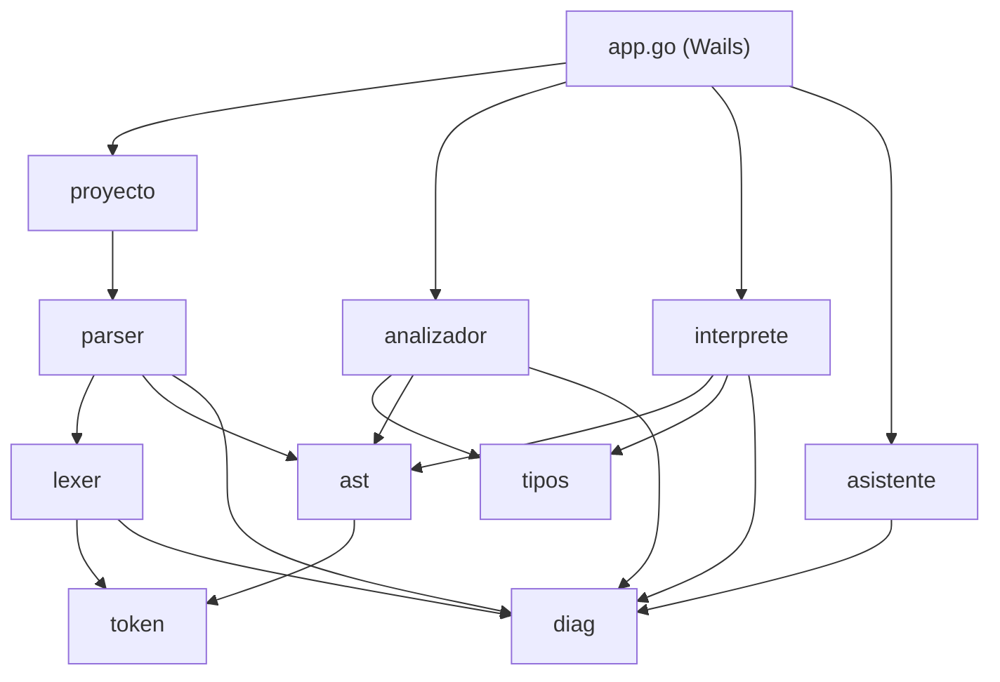
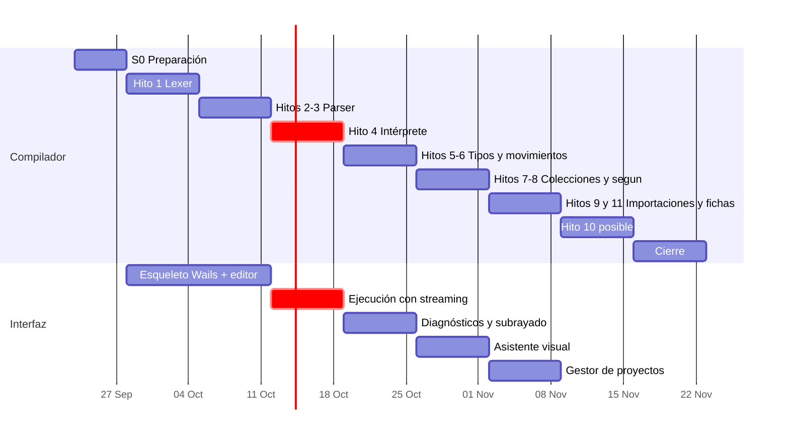
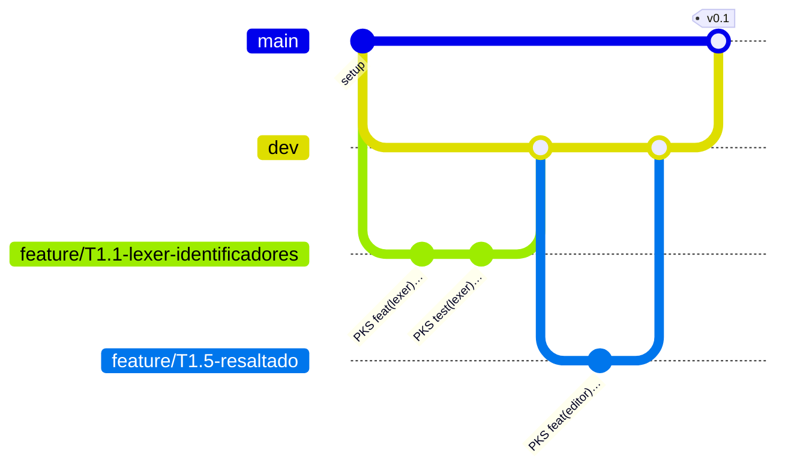

# 🗺️ Plan de implementación de PokeScript

Este es el documento de coordinación del equipo: quién hace qué, en qué orden, cómo se integra y cuándo algo se da por terminado. La especificación del lenguaje ([`PokeScript_Especificacion_Implementacion.md`](PokeScript_Especificacion_Implementacion.md)) dice **qué** construir; este plan dice **cómo** lo construimos entre los tres.

> **Regla de oro:** si este plan y la especificación se contradicen, manda la especificación. Si la especificación no dice algo, se decide en equipo y se anota en la sección [Decisiones](#-registro-de-decisiones).

---

## 📌 Índice

1. [Prioridades](#-prioridades)
2. [Equipo y roles](#-equipo-y-roles)
3. [Arquitectura del código](#-arquitectura-del-código)
4. [Contratos entre módulos](#-contratos-entre-módulos)
5. [Cronograma](#-cronograma)
6. [Tareas por sprint](#-tareas-por-sprint)
7. [Estrategia de pruebas](#-estrategia-de-pruebas)
8. [Flujo de trabajo en Git](#-flujo-de-trabajo-en-git)
9. [Definición de terminado](#-definición-de-terminado)
10. [Riesgos y recortes](#-riesgos-y-recortes)
11. [Preparación para la defensa](#-preparación-para-la-defensa)
12. [Registro de decisiones](#-registro-de-decisiones)

---

## 🎯 Prioridades

Lo que vale la nota, en orden:

| #   | Prioridad                                                  | Por qué                                                                                     |
| --- | ---------------------------------------------------------- | ------------------------------------------------------------------------------------------- |
| 1   | **Llegar al hito 4** (primer programa corriendo en el IDE) | Convierte el proyecto en algo demostrable. Todo lo demás se construye encima.               |
| 2   | **Commits de los tres, desde ya**                          | Es 5 % de la nota y no se recupera después. Cada integrante hace commits todas las semanas. |
| 3   | **El diagnóstico de bloque sin cerrar**                    | Es el diagnóstico estrella del lenguaje. Va en el sprint del parser, no al final.           |
| 4   | **Asistente con distancia de edición**                     | Es barato y es la innovación. No se deja de último.                                         |
| 5   | **Que cada integrante pueda explicar todo el sistema**     | La defensa (25 %) es **individual**.                                                        |

El aplicativo vale 35 % y la defensa 25 %. La documentación ya está casi lista: **el riesgo está todo en el código**.

---

## 👥 Equipo y roles

Cada rol es **dueño** de un área, pero no trabaja solo en ella: todo PR lo revisa otra persona, y los roles rotan en las tareas de revisión para que los tres conozcan todo el sistema.

| Rol                            | Integrante    | Área principal                                                           | Paquetes                                                                            |
| ------------------------------ | ------------- | ------------------------------------------------------------------------ | ----------------------------------------------------------------------------------- |
| **A · Interfaz**               | _por asignar_ | Wails, Svelte, CodeMirror, gestor de proyectos, salida, asistente visual | `frontend/`, `app.go`, `main.go`                                                    |
| **B · Frontal del compilador** | _por asignar_ | Tokens, lexer, AST, parser, recuperación de errores, pila de bloques     | `internal/token`, `internal/lexer`, `internal/ast`, `internal/parser`               |
| **C · Semántica y ejecución**  | _por asignar_ | Intérprete, sistema de tipos, analizador, importaciones                  | `internal/interprete`, `internal/tipos`, `internal/analizador`, `internal/proyecto` |

**Áreas compartidas:**

- `internal/diag` (diagnósticos): lo define **B** en el sprint 0, lo usan todos.
- `internal/asistente`: lo implementa **A** (reglas y Levenshtein) con apoyo de **C** (tabla de símbolos).
- `testdata/` y casos de prueba de la sección 11: cada dueño escribe los de su área; **C** mantiene la prueba completa del programa de la sección 10.

> ✏️ Anoten sus nombres en la tabla en el primer commit de cada uno. Es un buen primer commit: `PKS docs: assign team roles in plan`.

---

## 🧱 Arquitectura del código

### Estructura de carpetas

```text
PokeScript/
├── main.go                     ← arranque de Wails
├── app.go                      ← métodos expuestos a Svelte (puente)
├── go.mod
├── internal/
│   ├── token/                  ← TokenKind, Token, palabras reservadas
│   ├── lexer/                  ← texto → []Token
│   ├── ast/                    ← nodos del árbol (todos con Line/Col/Len)
│   ├── parser/                 ← []Token → *ast.Programa + []Diagnostic
│   ├── diag/                   ← Diagnostic, Fix, encabezados temáticos
│   ├── tipos/                  ← Type, tabla de efectividades, operaciones
│   ├── analizador/             ← tabla de símbolos, 2 pasadas, validaciones
│   ├── interprete/             ← valores en ejecución y evaluación del AST
│   ├── proyecto/               ← proyecto.json, archivos .pks, grafo de importaciones
│   └── asistente/              ← explicaciones y sugerencias (Levenshtein)
├── frontend/                   ← Svelte + CodeMirror 6
│   └── src/
│       ├── lib/editor/         ← lenguaje PokeScript para CodeMirror, subrayados
│       ├── lib/paneles/        ← salida, diagnósticos, asistente, consulta
│       └── lib/estado.js       ← stores: proyecto, archivoActivo, diagnosticos…
├── ejemplos/                   ← proyectos de ejemplo (.pks + proyecto.json)
└── docs/
```

### Reglas de dependencia



- **Nada dentro de `internal/` importa Wails.** Así todo se prueba con `go test` sin interfaz, y el CI no necesita instalar GTK ni WebKit.
- Las flechas van en un solo sentido: `lexer` no conoce al `parser`, el `parser` no conoce al `analizador`, etc.
- El único que conoce a todos es `app.go`.

---

## 🤝 Contratos entre módulos

Estos tipos se acuerdan **en el sprint 0**, antes de que cada quien arranque su parte. Mientras el contrato no cambie, los tres pueden trabajar en paralelo. Cambiar un contrato requiere avisar en el grupo y un PR revisado por los otros dos.

### `internal/token`

```go
type Token struct {
    Kind   Kind
    Lexeme string
    Line   int // base 1
    Col    int // base 1
    Len    int // en runas, para el subrayado
}
```

### `internal/diag`

```go
type Diagnostic struct {
    Severity string // "error" | "advertencia"
    Category string // "lexico" | "sintactico" | "semantico" | "importacion" | "ejecucion"
    Code     string // subcódigo estable, ej. "bloque-sin-cerrar", "tipo-incompatible"
    Heading  string // "¡Se escapó!", "No es muy efectivo…", …
    File     string
    Line, Col, Len int
    Desc, Cause, Suggest string
    Fix      *Fix
}
```

El campo `Code` no está en la especificación: lo agregamos para que el asistente tenga una clave estable (`Category + Code`) con la que buscar su plantilla de explicación. Ver [Decisiones](#-registro-de-decisiones).

### `internal/ast`

Todos los nodos llevan su posición. La propuesta base:

```go
type Pos struct{ Line, Col, Len int }

type Nodo interface{ Posicion() Pos }
type Expr interface{ Nodo; expr() }
type Instr interface{ Nodo; instr() }
```

**B** escribe la lista completa de nodos (uno por regla de la gramática) en el sprint 0 y **C** la revisa, porque el intérprete y el analizador la recorren.

### `internal/interprete`: entrada y salida

El intérprete **no sabe** que existe Wails. Recibe una interfaz:

```go
type ES interface {
    Escribir(linea string)                 // gritar
    Leer(prompt string) (string, error)    // capturar: bloquea hasta recibir texto
}
```

- En las pruebas: una implementación falsa que guarda la salida en un `[]string` y responde entradas desde una lista.
- En la app: `app.go` implementa `ES` con `runtime.EventsEmit` para la salida y un canal que se llena con `EnviarEntrada`.
- La ejecución corre en una goroutine y recibe un `context.Context` para poder detenerla desde el botón de la interfaz.

### Puente Wails (`app.go`)

Los métodos de la sección 9 de la especificación:

| Método                        | Devuelve               | Notas                                                                       |
| ----------------------------- | ---------------------- | --------------------------------------------------------------------------- |
| `CompilarProyecto(ruta)`      | `ResultadoCompilacion` | diagnósticos + tabla de símbolos para autocompletado                        |
| `EjecutarProyecto(ruta)`      | nada                   | emite eventos `salida`, `pedir-entrada`, `error-ejecucion`, `fin-ejecucion` |
| `EnviarEntrada(texto)`        | nada                   | respuesta a `capturar`                                                      |
| `DetenerEjecucion()`          | nada                   | cancela el contexto                                                         |
| `ObtenerTablaEfectividades()` | `[][]string`           | para el menú de consulta                                                    |
| `ObtenerPalabrasReservadas()` | `[]PalabraDoc`         | para el menú de consulta y el resaltado                                     |

**A** y **C** acuerdan los nombres exactos de los eventos en el sprint 0.

---

## 📅 Cronograma

Sprints de una semana, de lunes a domingo. **Ajusten las fechas a la fecha real de entrega del enunciado**: si la entrega es antes, se recortan primero las tareas marcadas como _prescindibles_.

| Sprint | Fechas         | Hitos       | Meta demostrable                                            |
| ------ | -------------- | ----------- | ----------------------------------------------------------- |
| **S0** | 23 – 27 sep    | Preparación | Proyecto Wails abre, CI en verde, contratos acordados       |
| **S1** | 28 sep – 4 oct | 1           | Lexer completo; el editor colorea código PokeScript         |
| **S2** | 5 – 11 oct     | 2, 3        | Parser completo; diagnóstico de bloque sin cerrar           |
| **S3** | 12 – 18 oct    | 4           | 🏁 **Primer programa corriendo en el IDE** (`v0.1`)         |
| **S4** | 19 – 25 oct    | 5, 6        | Errores de tipos y movimientos con parámetros               |
| **S5** | 26 oct – 1 nov | 7, 8, 12    | Colecciones, `segun` exhaustivo y asistente básico (`v0.2`) |
| **S6** | 2 – 8 nov      | 9, 11       | Proyectos de varios archivos y fichas                       |
| **S7** | 9 – 15 nov     | 10          | Programa de la sección 10 corre completo (`v0.3`)           |
| **S8** | 16 – 22 nov    | Cierre      | Pulido, pruebas, manual, ensayo de defensa (`v1.0`)         |



---

## 📋 Tareas por sprint

Cada tarea tiene un identificador (`T1.3`) para usarlo en el nombre de la rama y en el PR. Responsable: **A**, **B** o **C**.

### S0 · Preparación (23 – 27 sep)

| ID   | Tarea                                                                                              | Resp.          | Listo cuando                       |
| ---- | -------------------------------------------------------------------------------------------------- | -------------- | ---------------------------------- |
| T0.1 | Instalar Go ≥ 1.23, Node ≥ 22 y Wails CLI v2; correr `wails doctor` sin errores                    | Todos          | Cada quien lo confirma en el grupo |
| T0.2 | `wails init -n PokeScript -t svelte` e integrarlo a la estructura del repo (raíz Go + `frontend/`) | A              | `wails dev` abre una ventana       |
| T0.3 | Crear `go.mod` y los paquetes vacíos de `internal/` con un `doc.go` cada uno                       | B              | `go build ./...` y el CI pasan     |
| T0.4 | Escribir `internal/token` (todos los `Kind`, tabla de 48 palabras reservadas) y `internal/diag`    | B              | Revisado por A y C                 |
| T0.5 | Proponer la lista de nodos de `internal/ast`                                                       | B              | Revisado por C                     |
| T0.6 | Proponer la interfaz `ES` y los nombres de eventos de Wails                                        | C              | Revisado por A                     |
| T0.7 | Proteger `main` y `dev` en GitHub (PR obligatorio + CI en verde)                                   | Dueño del repo | Push directo a `dev` rechazado     |
| T0.8 | Crear el tablero en GitHub Projects con las tareas de este plan                                    | Todos          | Cada tarea tiene su tarjeta        |

### S1 · Hito 1: lexer (28 sep – 4 oct)

| ID   | Tarea                                                                                                                      | Resp. | Listo cuando                                          |
| ---- | -------------------------------------------------------------------------------------------------------------------------- | ----- | ----------------------------------------------------- |
| T1.1 | Lexer: identificadores con `ñ` y tildes, palabras reservadas, números `roca`/`agua`                                        | B     | Pruebas de tabla pasan                                |
| T1.2 | Lexer: `fuego`, `planta` con escapes `\"` `\n` `\\`; escape desconocido = error léxico                                     | B     | Incluye caso "cadena sin cerrar" (sección 11)         |
| T1.3 | Lexer: `sino si` como `SINO_SI`, punto de `6.9` vs `chispo.vida`, `//` comentarios                                         | B     | Pruebas de los casos ambiguos                         |
| T1.4 | Lexer: `NEWLINE` significativo, líneas en blanco y comentarios sin `NEWLINE` propio, columna inicial de cada línea         | B     | Pruebas                                               |
| T1.5 | Resaltado en CodeMirror 6 con `StreamLanguage` (categorías: reservada, tipo, literal, identificador, comentario, operador) | A     | Los ejemplos del README se ven coloreados             |
| T1.6 | Diseño base del IDE: editor, panel de salida, panel de diagnósticos, barra con Compilar / Ejecutar                         | A     | Maqueta funcional (botones aún sin lógica)            |
| T1.7 | `internal/interprete`: tipos de valores en ejecución (sección 3.4), incluida la mochila con orden de inserción             | C     | Pruebas de la mochila ordenada y de la copia profunda |

### S2 · Hitos 2 y 3: parser (5 – 11 oct)

| ID   | Tarea                                                                                                                         | Resp. | Listo cuando                                                      |
| ---- | ----------------------------------------------------------------------------------------------------------------------------- | ----- | ----------------------------------------------------------------- |
| T2.1 | Parser de expresiones con la jerarquía `expr_o` → `expr_acceso`; `2 + 3 * 4` da el árbol correcto                             | B     | Pruebas de precedencia                                            |
| T2.2 | Operadores no encadenables: `a > b > c` es error sintáctico                                                                   | B     | Caso de la sección 11                                             |
| T2.3 | Parser de instrucciones y bloques, anticipación de 2 tokens, retroceso en `decl_dato`                                         | B     | Árbol completo de los 4 archivos de la sección 10                 |
| T2.4 | ⭐ Pila de bloques: el error dice **en qué línea se abrió** el bloque sin `fin`                                               | B     | Caso "falta un `fin`" de la sección 11                            |
| T2.5 | Recuperación hasta el siguiente `NEWLINE`, máximo 20 diagnósticos                                                             | B     | Casos "dos instrucciones en una línea" y "`recorrer` sin `hasta`" |
| T2.6 | Intérprete: evaluar expresiones sobre un AST (aritmética, comparación, `y`/`o` en cortocircuito)                              | C     | Pruebas con AST armados a mano, sin esperar al parser             |
| T2.7 | Método `CompilarProyecto` en `app.go` (por ahora solo lexer + parser) y subrayado de errores en CodeMirror con `Line/Col/Len` | A     | Un error de sintaxis se subraya en el editor                      |

### S3 · Hito 4: primer programa corriendo (12 – 18 oct) 🏁

| ID   | Tarea                                                                                                                    | Resp. | Listo cuando                                           |
| ---- | ------------------------------------------------------------------------------------------------------------------------ | ----- | ------------------------------------------------------ |
| T3.1 | Intérprete: variables, asignación, `gritar`, `si`/`sino si`/`sino`, `mientras`, `recorrer` de rango, `huir`, `siguiente` | C     | Pruebas con programas `.pks` en `testdata/`            |
| T3.2 | Intérprete: `capturar` usando la interfaz `ES`                                                                           | C     | Prueba con entrada simulada                            |
| T3.3 | Errores de ejecución: división entre cero, desbordamiento de `roca`                                                      | C     | Diagnóstico `¡Falló el ataque!` con línea              |
| T3.4 | `EjecutarProyecto` con streaming por eventos, `EnviarEntrada` y `DetenerEjecucion`                                       | A + C | En el IDE: `capturar` pide un dato y el programa sigue |
| T3.5 | Panel de salida con caja de entrada cuando el programa espera `capturar`                                                 | A     | Demo en vivo                                           |
| T3.6 | Etiqueta `v0.1` en `main` y video corto de la demo                                                                       | Todos | Tag publicado                                          |

### S4 · Hitos 5 y 6: tipos y movimientos (19 – 25 oct)

| ID   | Tarea                                                                                                                    | Resp. | Listo cuando                            |
| ---- | ------------------------------------------------------------------------------------------------------------------------ | ----- | --------------------------------------- |
| T4.1 | `internal/tipos`: `Type`, tabla de efectividades, tabla de operaciones (secciones 3.2 y 3.3)                             | C     | Pruebas celda por celda                 |
| T4.2 | Analizador, pasada 1: tabla de símbolos, medallas, cabeceras de movimientos, un solo `combate`                           | C     | Pruebas                                 |
| T4.3 | Analizador, pasada 2: tipos de expresiones, condiciones `electrico`, reasignación de `medalla`, ocultamiento             | C     | Casos semánticos 1 y 4 de la sección 11 |
| T4.4 | Asignación definida (sección 4.2)                                                                                        | B     | Caso semántico 5 de la sección 11       |
| T4.5 | Movimientos: parámetros por valor con copia profunda, `entregar`, retorno por todos los caminos, límite de 1000 llamadas | C     | Pruebas de recursión y de copia         |
| T4.6 | Diagnósticos con encabezados temáticos y panel de diagnósticos navegable (clic → salta a la línea)                       | A     | Demo                                    |

### S5 · Hitos 7, 8 y 12: colecciones, `segun` y asistente (26 oct – 1 nov)

| ID   | Tarea                                                                                                                          | Resp. | Listo cuando                                                 |
| ---- | ------------------------------------------------------------------------------------------------------------------------------ | ----- | ------------------------------------------------------------ |
| T5.1 | `equipo` y `mochila`: literales, acceso `[ ]` desde 1, `sumar`, `quitar`, `contiene`, `tamaño`, `recorrer` con 1 y 2 variables | C     | Pruebas, incluidos índice fuera de rango y clave inexistente |
| T5.2 | Prohibido modificar la colección que se recorre; la variable de recorrido es de solo lectura                                   | B     | Pruebas                                                      |
| T5.3 | `especie` y `segun`: exhaustivo **nombrando los faltantes**, `otro` obligatorio en tipos abiertos, ramas inalcanzables         | B     | Caso semántico 2 de la sección 11                            |
| T5.4 | Asistente: plantillas por `Category + Code` y sugerencia por Levenshtein (distancia ≤ 2 o ≤ 1/3 de la longitud)                | A     | Escribir `curra(vida)` sugiere `curar`                       |
| T5.5 | Botón "Aplicar arreglo" en el editor (`Fix` → `dispatch`)                                                                      | A     | Demo                                                         |
| T5.6 | Etiqueta `v0.2`                                                                                                                | Todos | Tag publicado                                                |

### S6 · Hitos 9 y 11: importaciones y fichas (2 – 8 nov)

| ID   | Tarea                                                                                                     | Resp. | Listo cuando                                |
| ---- | --------------------------------------------------------------------------------------------------------- | ----- | ------------------------------------------- |
| T6.1 | `internal/proyecto`: leer `proyecto.json`, cargar los `.pks`, resolver `enseñar … desde`                  | C     | Casos de importación 1 y 2 de la sección 11 |
| T6.2 | Grafo de dependencias y detección de ciclos con **la cadena completa**                                    | C     | Caso `a.pks → b.pks → a.pks`                |
| T6.3 | Tipos de argumentos en movimientos importados                                                             | C     | Caso de importación 3                       |
| T6.4 | `ficha`: declaración, literal (completo, sin repetir, sin campos ajenos), acceso con `.`                  | B     | Pruebas                                     |
| T6.5 | Resolver `{ }` como mochila o ficha según el tipo esperado                                                | B     | Pruebas de ambos casos                      |
| T6.6 | Gestor de proyectos en la interfaz: abrir/crear carpeta, árbol de archivos, pestañas, marcar el principal | A     | Demo con el proyecto de la sección 10       |

### S7 · Hito 10: `posible` y programa completo (9 – 15 nov)

| ID   | Tarea                                                                                            | Resp. | Listo cuando                         |
| ---- | ------------------------------------------------------------------------------------------------ | ----- | ------------------------------------ |
| T7.1 | `posible` y su literal nulo, operador `sino` de respaldo                                         | B     | Pruebas                              |
| T7.2 | Estrechamiento con `igual`/`diferente` contra el nulo, propagación por `y`, pérdida al reasignar | B     | Caso semántico 3 de la sección 11    |
| T7.3 | `convertir`, `redondear` y `aleatorio` completos, con sus errores de ejecución                   | C     | Pruebas                              |
| T7.4 | 🏆 El programa de la sección 10 corre completo en el IDE                                         | Todos | Prueba de integración en `ejemplos/` |
| T7.5 | Menú de consulta: tabla de efectividades y palabras reservadas                                   | A     | Demo                                 |
| T7.6 | Etiqueta `v0.3`                                                                                  | Todos | Tag publicado                        |

### S8 · Cierre (16 – 22 nov)

| ID   | Tarea                                                                              | Resp. | Listo cuando                                 |
| ---- | ---------------------------------------------------------------------------------- | ----- | -------------------------------------------- |
| T8.1 | Correr los 15 casos de la sección 11 y el programa completo; corregir lo que falle | Todos | Todos pasan en el CI                         |
| T8.2 | Advertencias 18 a 23 de la sección 4 (las 20 a 23 son _prescindibles_)             | B + C | 18 y 19 hechas; 20 a 23 solo si sobra tiempo |
| T8.3 | Sonidos con Howler.js (compilación exitosa, error, captura)                        | A     | _Prescindible_                               |
| T8.4 | Proyecto de ejemplo del entregable y manual de usuario                             | A     | Revisado por B y C                           |
| T8.5 | Compilar el ejecutable final con `wails build` para Windows                        | A     | El `.exe` corre en otra máquina              |
| T8.6 | Ensayo de defensa cruzada (ver abajo)                                              | Todos | Cada quien explica un módulo que no hizo     |
| T8.7 | Etiqueta `v1.0` en `main`                                                          | Todos | Tag publicado                                |

---

## 🧪 Estrategia de pruebas

### Pruebas unitarias en Go

- Un archivo `*_test.go` junto a cada archivo de código, con **pruebas de tabla**.
- `go test ./internal/...` debe pasar antes de abrir un PR. El CI lo repite con `-race`.

### Pruebas de programas completos (golden files)

Cada caso vive en `testdata/` dentro del paquete que lo prueba:

```text
internal/interprete/testdata/
├── hola_mundo.pks          ← programa
├── hola_mundo.entrada      ← (opcional) respuestas para capturar, una por línea
└── hola_mundo.salida       ← salida esperada exacta

internal/analizador/testdata/
├── segun_incompleto.pks
└── segun_incompleto.diag   ← diagnósticos esperados: línea:col categoría código
```

Un solo `TestProgramas` recorre la carpeta, ejecuta cada `.pks` y compara con el archivo esperado. Agregar un caso nuevo es agregar dos archivos, sin tocar código.

### Casos obligatorios (sección 11 de la especificación)

| Caso                                                     | Sprint | Resp. |
| -------------------------------------------------------- | ------ | ----- |
| Sintáctico 1 · falta un `fin` (indica línea de apertura) | S2     | B     |
| Sintáctico 2 · `a > b > c`                               | S2     | B     |
| Sintáctico 3 · dos instrucciones en una línea            | S2     | B     |
| Sintáctico 4 · cadena sin cerrar                         | S1     | B     |
| Sintáctico 5 · `recorrer n de 1 a 10`                    | S2     | B     |
| Semántico 1 · `roca + electrico`                         | S4     | C     |
| Semántico 2 · `segun` con un valor sin cubrir            | S5     | B     |
| Semántico 3 · `posible` sin comprobar                    | S7     | B     |
| Semántico 4 · reasignación de `medalla`                  | S4     | C     |
| Semántico 5 · dato leído sin valor                       | S4     | B     |
| Importación 1 · archivo inexistente                      | S6     | C     |
| Importación 2 · nombre inexistente en el archivo         | S6     | C     |
| Importación 3 · argumentos de tipo incorrecto            | S6     | C     |
| Importación 4 · ciclo con la cadena completa             | S6     | C     |
| Prueba completa · programa de la sección 10              | S7     | Todos |

### Interfaz

Sin pruebas automáticas en la interfaz (no alcanza el tiempo). Cada PR de **A** incluye una captura o un GIF corto de lo que cambió.

---

## 🌿 Flujo de trabajo en Git



1. Cada tarea sale en su propia rama desde `dev`: `feature/T<id>-<descripcion-corta>` (o `fix/…` para correcciones).
2. Commits pequeños, con el formato `PKS type(scope): description` en inglés (ver [CONTRIBUTING.md](../CONTRIBUTING.md)).
3. PR hacia `dev` con el ID de la tarea en el título. **Lo revisa al menos otra persona.** El CI debe estar en verde.
4. Merge con **merge commit** (no squash), para que los commits de cada integrante queden en el historial.
5. Al cerrar cada hito demostrable, PR de `dev` a `main` y etiqueta (`v0.1`, `v0.2`, …).

**Reglas de convivencia:**

- Nadie hace push directo a `dev` ni a `main`.
- Un PR abierto más de 2 días sin revisión se menciona en el grupo.
- Antes de empezar el día: `git pull` en `dev` y rebase de la rama propia.
- Si una tarea bloquea a otra persona, esa tarea tiene prioridad.

### Reunión semanal (30 min)

Al inicio de cada sprint (lunes):

1. Demo de lo que se terminó en el sprint anterior.
2. Revisión del tablero: qué quedó pendiente y por qué.
3. Asignar las tareas del sprint nuevo.
4. Anotar cualquier decisión en el [registro](#-registro-de-decisiones).

---

## ✅ Definición de terminado

Una tarea está terminada cuando:

- [ ] El código está en `dev` mediante un PR revisado por otra persona.
- [ ] El CI está en verde (commitlint, formato, ortografía, `go vet`, pruebas).
- [ ] Tiene pruebas (Go) o captura/GIF (interfaz).
- [ ] Los diagnósticos que produce llevan `Line`, `Col` y `Len` correctos y están en español con su encabezado temático.
- [ ] Si cambió un contrato, los otros dos lo aprobaron.
- [ ] La tarjeta del tablero está en "Hecho".

---

## 🚧 Riesgos y recortes

| Riesgo                                       | Probabilidad | Plan                                                                                                   |
| -------------------------------------------- | ------------ | ------------------------------------------------------------------------------------------------------ |
| No llegar al hito 4 a tiempo                 | Media        | El intérprete (C) arranca en S1 con AST armados a mano, sin esperar al parser.                         |
| El puente Wails con `capturar` se complica   | Media        | La interfaz `ES` aísla el problema; se prueba primero con una versión de consola (`go run ./cmd/pks`). |
| Un integrante se atrasa                      | Media        | Las tareas de cada sprint se revisan el lunes; se redistribuyen sin esperar.                           |
| La gramática tiene ambigüedades no previstas | Baja         | Se resuelve en equipo y se anota en el registro de decisiones.                                         |
| Poco tiempo al final                         | Alta         | Se recortan en este orden: advertencias 20–23 → sonidos → PixiJS → advertencias 18–19.                 |

**Lo que no se recorta nunca:** hito 4, diagnóstico de bloque sin cerrar, asistente con Levenshtein, los 15 casos de la sección 11 y el programa de la sección 10.

### Herramienta de consola (recomendada)

Además del IDE, un comando mínimo en `cmd/pks/main.go` que compila y ejecuta un proyecto desde la terminal:

```bash
go run ./cmd/pks ejemplos/combate
```

Sirve para probar el compilador sin abrir Wails y es un plan B para la demo si la interfaz falla.

---

## 🎤 Preparación para la defensa

La defensa es individual: cualquiera puede recibir preguntas sobre cualquier parte. Para eso:

- **Revisiones cruzadas:** A revisa PRs de B y C, B revisa de C y A, C revisa de A y B. Revisar incluye poder explicar el cambio.
- **Explicación rotativa:** en cada reunión semanal, alguien explica en 5 minutos un módulo que **no** escribió.
- **Preguntas que cada integrante debe poder responder:**
  - ¿Cómo distingue el lexer `6.9` de `chispo.vida`?
  - ¿Cómo se implementa la precedencia de operadores en el parser?
  - ¿Cómo sabe el parser en qué línea se abrió un bloque sin cerrar?
  - ¿Por qué `{ }` se resuelve en el analizador y no en el parser?
  - ¿Cómo funciona la asignación definida?
  - ¿Cómo se verifica que un `segun` sea exhaustivo?
  - ¿Por qué la mochila no puede ser un `map` de Go?
  - ¿Cómo viaja un `capturar` desde Go hasta Svelte y de vuelta?
  - ¿Cómo elige el asistente la sugerencia con distancia de edición?
  - ¿Cómo se detecta un ciclo de importaciones?

---

## 📝 Registro de decisiones

Todo lo que la especificación no define y el equipo decide. Formato: fecha, decisión, motivo.

| Fecha      | Decisión                                                                                                      | Motivo                                                                                           |
| ---------- | ------------------------------------------------------------------------------------------------------------- | ------------------------------------------------------------------------------------------------ |
| 2026-09-23 | El compilador vive en `internal/` y no importa Wails                                                          | Se prueba con `go test` y el CI no necesita la interfaz                                          |
| 2026-09-23 | Se agrega el campo `Code` a `Diagnostic`                                                                      | Clave estable para las plantillas del asistente                                                  |
| 2026-09-23 | El intérprete recibe la interfaz `ES` para `gritar` y `capturar`                                              | Permite probarlo sin interfaz y conectar Wails por eventos                                       |
| 2026-09-23 | Merge commits (no squash) de las ramas a `dev`                                                                | Conservar los commits de cada integrante                                                         |
| 2026-09-23 | `go.mod` declara `go 1.23`, aunque se desarrolle con una versión más nueva                                    | El CI instala esa versión y nadie usa algo que los demás no tengan                               |
| 2026-09-23 | Linter `misspell` desactivado en golangci-lint                                                                | Solo conoce inglés y marca los comentarios en español; CSpell revisa ambos idiomas               |
| 2026-09-23 | En `fuego` se aceptan los escapes `\'` `\n` `\\`                                                              | La especificación solo define los de `planta`; sin `\'` no se puede escribir una comilla simple  |
| 2026-09-23 | En `PLANTA_LIT` y `FUEGO_LIT`, `Lexeme` guarda el valor ya decodificado                                       | El parser no repite el manejo de escapes; `Col` y `Len` siguen apuntando al texto original       |
| 2026-09-23 | `==`, `!=`, `&&`, `\|\|` y `%` son error léxico, pero el lexer emite `igual`, `diferente`, `y`, `o` y `resto` | Explica el error de quien viene de otro lenguaje y el parser puede seguir sin errores en cascada |
| 2026-09-23 | Un token `ILLEGAL` ya fue reportado por el lexer; el parser lo salta sin reportarlo otra vez                  | Evita diagnósticos duplicados                                                                    |
|            | _Pendiente:_ cómo se muestra un `agua` con `gritar` (¿`12.0` o `12`?)                                         | La especificación no lo define                                                                   |
|            | _Pendiente:_ ¿asignar a una clave nueva de una mochila la agrega o es error?                                  | La especificación no lo define                                                                   |
